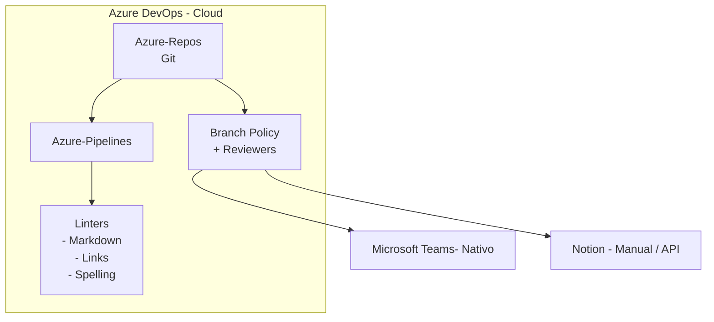

# Implementación con Azure DevOps - Guía Completa

## Alternativa a GitLab para Documentación IT

> **Ventaja Principal:** Si ya usas Azure DevOps, esta es la mejor opción  
> **Duración:** 4-8 horas (vs. 1-2 días con GitLab)  
> **Costo adicional:** €0 (ya tienes Azure DevOps)

---

## 🎯 Por Qué Azure DevOps es Mejor Para Ti

### Ventajas vs. GitLab

| Aspecto                   | Azure DevOps          | GitLab CE                 |
| ------------------------- | --------------------- | ------------------------- |
| **Setup**                 | Ya está configurado ✅ | Requiere VM + instalación |
| **SSO/AD**                | Ya integrado ✅        | Requiere configuración    |
| **Usuarios**              | Ya están ahí ✅        | Hay que crear todos       |
| **Teams Integration**     | Nativa ✅              | Webhook manual            |
| **Hosting**               | Microsoft cloud ✅     | Tu VM (mantenimiento)     |
| **Backup**                | Automático ✅          | Tienes que configurar     |
| **Costo infraestructura** | €0 ✅                  | VM + electricidad         |
| **Curva aprendizaje**     | Baja (ya lo usan) ✅   | Alta (tool nuevo)         |

### Lo Que NO Cambia

✅ Toda la estrategia (plan 12 meses)  
✅ Los 8 templates de documentación  
✅ La estructura del repositorio  
✅ CODEOWNERS / Required Reviewers  
✅ El proceso de aprobación  
✅ Los scripts de utilidad  
✅ La presentación para equipos  

**Solo cambia la implementación técnica (este documento)**

---

## 📋 Arquitectura con Azure DevOps



---

## 🚀 Implementación Paso a Paso

### Pre-requisitos

- ✅ Ya tienes Azure DevOps
- ✅ Ya tienes cuenta con permisos de admin
- ✅ Ya tienes SSO/AD configurado (probablemente)
- ✅ Ya tienes usuarios en el sistema

**Resultado: 80% del trabajo YA está hecho** 🎉

---

## 1. Crear Proyecto en Azure DevOps

### 1.1 Crear Proyecto

**En Azure DevOps Web:**

1. **Ir a tu Organization**
   
   - https://dev.azure.com/{tu-organizacion}

2. **Click "New Project"**
   
   - Project name: `Architecture Documentation`
   - Visibility: Private (o Enterprise según política)
   - Version control: **Git**
   - Work item process: Basic (o el que uses)
   - Click "Create"

3. **Resultado:**
   
   - Proyecto creado con URL:
   - `https://dev.azure.com/{org}/Architecture Documentation`

### 1.2 Configurar Repositorio

**Inicializar repo:**

```bash
# En tu máquina local
git clone https://dev.azure.com/{org}/Architecture%20Documentation/_git/architecture-docs
cd architecture-docs

# Crear estructura inicial
mkdir -p 00-templates 01-global 02-infrastructure 03-services 04-cross-cutting 06-decisions

# Crear README inicial
cat > README.md << 'EOF'
# Architecture Documentation

Single Source of Truth para documentación IT.

## Quick Links

- [Templates](./00-templates/)
- [Global Policies](./01-global/)
- [Infrastructure by Department](./02-infrastructure/)
- [Services](./03-services/)

## Getting Started

Ver [Contributing Guide](./CONTRIBUTING.md)
EOF

# Commit y push
git add .
git commit -m "Initial structure"
git push origin main
```

---

## 2. Configurar Azure Pipelines (CI/CD)

### 2.1 Crear azure-pipelines.yml

**En la raíz del repo:**

```yaml
# azure-pipelines.yml
# Pipeline para validación de documentación

trigger:
  branches:
    include:
      - main
      - features/*
  paths:
    include:
      - '**.md'
      - 'azure-pipelines.yml'

pr:
  branches:
    include:
      - main
  paths:
    include:
      - '**.md'

pool:
  vmImage: 'ubuntu-latest'

variables:
  FAIL_ON_WARNINGS: false

stages:
  - stage: Validate
    displayName: 'Validate Documentation'
    jobs:
      - job: Structure
        displayName: 'Validate Structure'
        steps:
          - checkout: self

          - bash: |
              echo "📁 Validating repository structure..."
              REQUIRED_DIRS="00-templates 01-global 02-infrastructure 03-services"
              MISSING=0
              for dir in $REQUIRED_DIRS; do
                if [ ! -d "$dir" ]; then
                  echo "##vso[task.logissue type=error]Missing required directory: $dir"
                  MISSING=1
                fi
              done

              if [ $MISSING -eq 1 ]; then
                echo "##vso[task.complete result=Failed;]Structure validation failed"
                exit 1
              fi

              echo "✅ Structure validation passed"
            displayName: 'Check Directory Structure'

      - job: Lint
        displayName: 'Lint Markdown'
        steps:
          - checkout: self

          - task: NodeTool@0
            inputs:
              versionSpec: '20.x'
            displayName: 'Install Node.js'

          - bash: |
              npm install -g markdownlint-cli markdown-link-check cspell
            displayName: 'Install Linters'

          - bash: |
              echo "📝 Linting markdown files..."
              find . -name "*.md" \
                -not -path "*/node_modules/*" \
                -not -path "*/.git/*" \
                | xargs markdownlint -c .markdownlint.json || {
                  echo "##vso[task.logissue type=error]Markdown linting failed"
                  exit 1
                }
              echo "✅ Markdown lint passed"
            displayName: 'Lint Markdown'
            continueOnError: false

          - bash: |
              echo "🔗 Checking links..."
              EXIT_CODE=0
              find . -name "*.md" \
                -not -path "*/node_modules/*" \
                -not -path "*/.git/*" \
                | while read file; do
                  markdown-link-check "$file" -c .markdown-link-check.json || EXIT_CODE=1
                done

              if [ $EXIT_CODE -ne 0 ]; then
                echo "##vso[task.logissue type=warning]Some links are broken"
              fi

              echo "✅ Link check complete"
            displayName: 'Check Links'
            continueOnError: true

          - bash: |
              echo "📖 Checking spelling..."
              find . -name "*.md" \
                -not -path "*/node_modules/*" \
                | xargs cspell --no-progress || true
              echo "✅ Spell check complete"
            displayName: 'Check Spelling'
            continueOnError: true

  - stage: Test
    displayName: 'Test Completeness'
    dependsOn: Validate
    condition: and(succeeded(), eq(variables['Build.SourceBranch'], 'refs/heads/main'))
    jobs:
      - job: Completeness
        displayName: 'Check Service Completeness'
        steps:
          - checkout: self

          - bash: |
              echo "🔍 Testing service documentation completeness..."

              for service_dir in 03-services/*/; do
                if [ -d "$service_dir" ]; then
                  service=$(basename "$service_dir")
                  echo "Checking service: $service"

                  FILES=(
                    "01-architecture-design.md"
                    "02-deployment-runbook.md"
                    "03-service-ownership.md"
                    "04-observability.md"
                  )

                  for file in "${FILES[@]}"; do
                    if [ ! -f "$service_dir/$file" ]; then
                      echo "##vso[task.logissue type=warning]Missing $file in $service"
                    fi
                  done
                fi
              done

              echo "✅ Completeness check complete"
            displayName: 'Check Service Docs'

  - stage: Notify
    displayName: 'Send Notifications'
    dependsOn: Test
    condition: always()
    jobs:
      - job: Teams
        displayName: 'Notify Teams'
        steps:
          - checkout: none

          - bash: |
              echo "📢 Sending notification to Teams..."

              # Determinar estado
              if [ "$(stageDependencies.Validate.Lint.result)" == "Succeeded" ]; then
                COLOR="28a745"
                TITLE="✅ Documentation Pipeline Passed"
                SUMMARY="All validation checks passed"
              else
                COLOR="dc3545"
                TITLE="❌ Documentation Pipeline Failed"
                SUMMARY="Some validation checks failed"
              fi

              # Enviar a Teams (si webhook configurado)
              if [ -n "$(TEAMS_WEBHOOK_URL)" ]; then
                curl -H "Content-Type: application/json" -d "{
                  \"@type\": \"MessageCard\",
                  \"@context\": \"https://schema.org/extensions\",
                  \"summary\": \"$SUMMARY\",
                  \"themeColor\": \"$COLOR\",
                  \"title\": \"$TITLE\",
                  \"sections\": [{
                    \"facts\": [
                      {\"name\": \"Project\", \"value\": \"$(Build.Repository.Name)\"},
                      {\"name\": \"Branch\", \"value\": \"$(Build.SourceBranchName)\"},
                      {\"name\": \"Author\", \"value\": \"$(Build.RequestedFor)\"},
                      {\"name\": \"Commit\", \"value\": \"$(Build.SourceVersion)\"}
                    ]
                  }],
                  \"potentialAction\": [{
                    \"@type\": \"OpenUri\",
                    \"name\": \"View Pipeline\",
                    \"targets\": [{
                      \"os\": \"default\",
                      \"uri\": \"$(System.CollectionUri)$(System.TeamProject)/_build/results?buildId=$(Build.BuildId)\"
                    }]
                  }]
                }" "$(TEAMS_WEBHOOK_URL)"
              fi

              echo "✅ Notification sent"
            displayName: 'Send Teams Notification'
            env:
              TEAMS_WEBHOOK_URL: $(TEAMS_WEBHOOK_URL)
```

### 2.2 Configurar Pipeline en Azure DevOps

**En Azure DevOps Web:**

1. **Ir a Pipelines → Create Pipeline**

2. **Seleccionar:**
   
   - Where is your code? **Azure Repos Git**
   - Select repository: **architecture-docs**
   - Configure: **Existing Azure Pipelines YAML file**
   - Path: `/azure-pipelines.yml`

3. **Click "Run"**
   
   - Primera ejecución se inicia automáticamente

4. **Verificar:**
   
   - Pipeline ejecuta correctamente
   - Todos los jobs pasan

### 2.3 Configurar Variables de Pipeline

**Para Teams webhook:**

1. **Pipelines → tu pipeline → Edit → Variables**

2. **Add variable:**
   
   - Name: `TEAMS_WEBHOOK_URL`
   - Value: `https://company.webhook.office.com/webhookb2/xxx...`
   - ✅ Keep this value secret
   - ✅ Let users override this value

3. **Save**

---

## 3. Configurar Branch Policies (Equivalent a Branch Protection)

### 3.1 Proteger Main Branch

**En Azure DevOps:**

1. **Repos → Branches**

2. **Find `main` → Click "..." → Branch policies**

3. **Configurar políticas:**

#### ✅ Require a minimum number of reviewers

- Minimum: **1 reviewer**
- ✅ Allow requestors to approve their own changes: **NO**
- ✅ Prohibit the most recent pusher from approving: **YES**
- ✅ Allow completion even if some reviewers vote to wait or reject: **NO**
- When new changes are pushed: **Reset all approval votes**

#### ✅ Check for linked work items

- Required / Optional según preferencia

#### ✅ Check for comment resolution

- ✅ **Required** (All comments must be resolved)

#### ✅ Build validation

- Build pipeline: **architecture-docs CI**
- Trigger: **Automatic**
- Policy requirement: **Required**
- Build expiration: **Immediately**
- Display name: `Documentation Validation`

### 3.2 Configurar Required Reviewers (Equivalent a CODEOWNERS)

**Dos opciones:**

#### Opción A: Branch Policies por Path (Recomendado)

En Branch policies → **Automatically included reviewers**:

```
Path: /02-infrastructure/hardware/*
Reviewers: @infrastructure-team, @hardware-lead
Policy: Required (at least 1)

Path: /02-infrastructure/devops/*
Reviewers: @devops-team, @k8s-admin
Policy: Required (at least 1)

Path: /02-infrastructure/cloud-azure/*
Reviewers: @cloud-team, @azure-architect
Policy: Required (at least 1)

Path: /00-templates/*
Reviewers: @architecture-team, @technical-writer
Policy: Required (at least 1)

# Etc. para cada departamento
```

#### Opción B: CODEOWNERS File (Más Simple)

Azure DevOps soporta `.azuredevops/CODEOWNERS`:

```bash
# Crear archivo
mkdir -p .azuredevops
cat > .azuredevops/CODEOWNERS << 'EOF'
# Azure DevOps CODEOWNERS File
# Syntax similar a GitHub/GitLab

# Global
* @architecture-team @tech-lead

# Templates
/00-templates/ @architecture-team @technical-writer

# Infrastructure by department
/02-infrastructure/hardware/ @infrastructure-team @hardware-lead
/02-infrastructure/virtualization/ @virtualization-team
/02-infrastructure/wan/ @network-team @wan-lead
/02-infrastructure/lan/ @network-team @lan-lead
/02-infrastructure/windows/ @windows-team @ad-admin
/02-infrastructure/linux/ @linux-team @linux-lead
/02-infrastructure/devops/ @devops-team @k8s-admin
/02-infrastructure/cloud-azure/ @cloud-team @azure-architect

# Services
/03-services/authentication-service/ @auth-team
/03-services/payment-gateway/ @payments-team

# Cross-cutting
/04-cross-cutting/security/ @security-team
/04-cross-cutting/compliance/ @compliance-team @legal-team

# ADRs
/06-decisions/ @architecture-team @principal-engineers
EOF

git add .azuredevops/
git commit -m "Add CODEOWNERS"
git push
```

**Activar:**

- Branch policies → **Automatically included reviewers**
- Add **Code Owners** as reviewers

---

## 4. Configurar Linters

### 4.1 Archivos de Configuración

**Mismo que GitLab - copiar estos archivos a la raíz:**

```bash
# .markdownlint.json
cat > .markdownlint.json << 'EOF'
{
  "default": true,
  "MD013": { "line_length": 120 },
  "MD033": { "allowed_elements": ["br", "details", "summary"] },
  "MD041": false
}
EOF

# .markdown-link-check.json
cat > .markdown-link-check.json << 'EOF'
{
  "ignorePatterns": [
    { "pattern": "^http://localhost" },
    { "pattern": "^https://localhost" }
  ],
  "timeout": "10s",
  "retryOn429": true
}
EOF

# cspell.json
cat > cspell.json << 'EOF'
{
  "version": "0.2",
  "language": "en,es",
  "words": [
    "devops",
    "kubernetes",
    "azure",
    "terraform",
    "ansible"
  ]
}
EOF

git add .markdownlint.json .markdown-link-check.json cspell.json
git commit -m "Add linter configs"
git push
```

### 4.2 Local Pre-commit (Opcional)

**Script para validar antes de push:**

```bash
# scripts/validate-local.sh
#!/bin/bash
echo "🔍 Running local validation..."

# Install linters if not present
if ! command -v markdownlint &> /dev/null; then
    echo "Installing linters..."
    npm install -g markdownlint-cli markdown-link-check cspell
fi

# Run validations
markdownlint **/*.md -c .markdownlint.json
markdown-link-check **/*.md -c .markdown-link-check.json
cspell **/*.md

echo "✅ Local validation complete"
```

---

## 5. Integración con Microsoft Teams (Nativa)

### 5.1 Teams Webhook (Ya Cubierto en Pipeline)

**Configurado en Sección 2.3**

El pipeline ya envía notificaciones automáticamente.

### 5.2 Integración Adicional con Azure Boards (Bonus)

**Si usan Azure Boards para trabajo:**

1. **Settings → Service hooks**

2. **Create subscription:**
   
   - Service: **Microsoft Teams**
   - Trigger: Various (Code pushed, PR created, PR merged, etc.)
   - Team: Seleccionar tu Teams channel
   - Filter: Project = Architecture Documentation

3. **Resultado:**
   
   - Notificaciones automáticas en Teams para todos los eventos
   - Más rico que webhook simple

### 5.3 Teams Tab para Azure DevOps (Bonus)

**Agregar tab en Teams channel:**

1. **En Teams channel → "+" → Azure DevOps**

2. **Configurar:**
   
   - Organization: Tu org
   - Project: Architecture Documentation
   - Type: Repos / Pipelines / Boards

3. **Resultado:**
   
   - Ver repos directamente en Teams
   - No necesitas salir de Teams para ver docs

---

## 6. Notion Setup (Igual que GitLab)

**Referencia:** Ver Sección 7 de `13-technical-implementation-guide.md`

No cambia nada - mismo proceso:

1. Crear workspace
2. Crear estructura de páginas
3. Sync manual o via API

---

## 7. Backup y Monitoring

### 7.1 Backup

**¡Ya está hecho!** 🎉

Azure DevOps tiene backup automático:

- Backups diarios automáticos
- Retención según tu plan
- No necesitas hacer nada

**Para backup adicional externo:**

```bash
# Script para clonar todos los repos
#!/bin/bash
# backup-azure-repos.sh

ORG="your-org"
PROJECT="Architecture Documentation"
PAT="your-personal-access-token"

# Clone repo
git clone https://$PAT@dev.azure.com/$ORG/$PROJECT/_git/architecture-docs
tar -czf backup-$(date +%Y%m%d).tar.gz architecture-docs/

# Upload to storage (Azure Blob, S3, etc.)
az storage blob upload \
  --account-name yourstorageaccount \
  --container-name backups \
  --file backup-$(date +%Y%m%d).tar.gz
```

### 7.2 Monitoring

**Built-in Analytics:**

1. **Repos → Analytics → Overview**
   
   - Commits per day
   - Active contributors
   - Files changed

2. **Pipelines → Analytics**
   
   - Build success rate
   - Duration trends
   - Failure analysis

3. **Custom Dashboard:**
   
   - Overview → Dashboards → New dashboard
   - Agregar widgets:
     - Pipeline success rate
     - Recent commits
     - Open PRs
     - Build duration

### 7.3 Alerting

**Configure Notifications:**

1. **User settings → Notifications**

2. **Enable alerts for:**
   
   - Build fails
   - PR requires review
   - PR comments
   - Code pushed to main

---

## 8. Scripts de Utilidad

### 8.1 Adaptar Scripts para Azure DevOps

**La mayoría funcionan igual**, solo pequeños cambios:

#### validate-docs.sh

```bash
# Funciona igual, sin cambios
./scripts/validate-docs.sh
```

#### new-service.sh

```bash
# Pequeño cambio en CODEOWNERS path
# Cambiar: CODEOWNERS
# Por: .azuredevops/CODEOWNERS
```

#### generate-metrics.py

```bash
# Funciona igual
./scripts/generate-metrics.py html
```

#### Azure DevOps Specific Scripts

**get-pr-stats.sh** (Nuevo):

```bash
#!/bin/bash
# Get PR statistics from Azure DevOps

ORG="your-org"
PROJECT="Architecture Documentation"
PAT="your-pat"

curl -u :$PAT \
  "https://dev.azure.com/$ORG/$PROJECT/_apis/git/repositories/architecture-docs/pullrequests?api-version=7.0" \
  | jq '.value[] | {id: .pullRequestId, title: .title, status: .status, createdBy: .createdBy.displayName}'
```

---

## 9. Workflow Completo

### 9.1 Workflow para Documentar Servicio

```bash
# 1. Crear branch
git checkout -b docs/add-payment-service

# 2. Crear estructura
./scripts/new-service.sh payment-service payments-team

# 3. Editar docs
cd 03-services/payment-service/
vim 01-architecture-design.md
# ... edit otros

# 4. Validar localmente
./scripts/validate-docs.sh 03-services/payment-service/

# 5. Commit y push
git add .
git commit -m "docs: Add payment service documentation"
git push origin docs/add-payment-service

# 6. Crear Pull Request en Azure DevOps Web
# Azure DevOps → Repos → Pull Requests → New

# 7. Pipeline ejecuta automáticamente
# 8. Required reviewers notificados
# 9. Review y approval
# 10. Merge (auto-delete branch opcional)
```

### 9.2 Pull Request Template

**Crear `.azuredevops/pull_request_template.md`:**

```markdown
## Description

[Describe what documentation is being added/updated]

## Type of change

- [ ] New service documentation
- [ ] Update existing documentation
- [ ] Fix typo/link
- [ ] Template change

## Checklist

- [ ] All required templates completed
- [ ] Diagrams included (if needed)
- [ ] CODEOWNERS updated (if new service)
- [ ] Links tested
- [ ] Spell checked

## Related Work Items

Closes #[work item ID]
```

---

## 10. Comparación Final: Azure DevOps vs GitLab

### Tiempo de Setup

| Tarea             | Azure DevOps   | GitLab CE         |
| ----------------- | -------------- | ----------------- |
| Infraestructura   | 0h (ya existe) | 4h (VM + install) |
| Pipeline setup    | 1h             | 2h                |
| Branch policies   | 1h             | 1h                |
| Teams integration | 30min (nativo) | 1h (webhook)      |
| Users/SSO         | 0h (ya existe) | 2h                |
| **TOTAL**         | **2.5h** ⚡     | **10h**           |

### Ventajas Azure DevOps

✅ **Setup 4x más rápido**
✅ **No requiere VM/hosting**
✅ **SSO ya configurado**
✅ **Usuarios ya existen**
✅ **Teams integration nativa**
✅ **Backup automático**
✅ **Más familiar para el equipo**
✅ **Azure Boards integration** (bonus)
✅ **Analytics built-in**

### Cuándo Usar GitLab En Su Lugar

❌ No tienes Azure DevOps
❌ Quieres self-hosted on-premise
❌ Compliance requiere data on-premise
❌ Ya usan GitLab para código
❌ Prefieren herramienta open-source

---

## 11. Troubleshooting Azure DevOps

### Pipeline Falla

**Error: "No hosted parallelism has been purchased"**

Solución:

1. Azure DevOps → Organization settings
2. Billing → Parallel jobs
3. Purchase at least 1 parallel job
   - Free tier: 1 parallel job, 1800 minutes/month
   - Or request free grant for public/OSS projects

**Error: Node packages not installing**

Solución:

```yaml
# Add to pipeline antes de npm install
- bash: |
    npm config set registry https://registry.npmjs.org/
  displayName: 'Configure npm'
```

### Branch Policy No Funciona

**Problema:** PRs no requieren approval

Solución:

1. Verificar branch policies están en `main`
2. Verificar "Minimum number of reviewers" > 0
3. Verificar "Policy requirement" = Required
4. Verificar required reviewers configurados

### CODEOWNERS No Reconocido

**Problema:** Required reviewers no se asignan automáticamente

Solución:

1. Archivo debe estar en `.azuredevops/CODEOWNERS`
2. Branch policy debe tener "Code Owners" enabled
3. Syntax: Same as GitHub CODEOWNERS
4. Verificar que los @mentions son users/teams válidos

### Teams No Recibe Notificaciones

**Problema:** Webhook no dispara

Solución:

1. Verificar variable `TEAMS_WEBHOOK_URL` configurada

2. Verificar es "secret" variable

3. Test manual:
   
   ```bash
   curl -H "Content-Type: application/json" \
     -d '{"text":"Test"}' \
     "$TEAMS_WEBHOOK_URL"
   ```

4. Verificar webhook no expiró en Teams

---

## 12. Migración desde GitLab (Si ya empezaste)

**Si ya instalaste GitLab y quieres migrar a Azure DevOps:**

### 12.1 Migrar Repositorio

```bash
# 1. Clonar GitLab repo
git clone https://gitlab.company.com/.../architecture-docs.git
cd architecture-docs

# 2. Añadir remote de Azure DevOps
git remote add azure https://dev.azure.com/{org}/{project}/_git/architecture-docs

# 3. Push a Azure DevOps
git push azure --all
git push azure --tags

# 4. Verificar en Azure DevOps Web
```

### 12.2 Migrar Pipeline

```bash
# 1. Convertir .gitlab-ci.yml a azure-pipelines.yml
# Ver ejemplos arriba - sintaxis diferente

# 2. Copiar archivos de config (sin cambios)
# .markdownlint.json
# .markdown-link-check.json
# cspell.json

# 3. Commit y push
git add azure-pipelines.yml
git commit -m "Add Azure Pipeline"
git push azure main
```

### 12.3 Migrar CODEOWNERS

```bash
# Mover archivo
mkdir -p .azuredevops
mv CODEOWNERS .azuredevops/CODEOWNERS

# O si usas branch policies, configurar en Web UI
```

### 12.4 Migrar Teams Webhook

1. Usar misma webhook URL
2. Configurar como variable en Azure Pipeline
3. No hay más cambios

---

## 13. Best Practices Específicas de Azure DevOps

### 13.1 Usar Azure Boards para Tracking

**Vincular docs a work items:**

```markdown
# En commits
git commit -m "docs: Add payment service #1234"

# En PRs
Closes AB#1234
```

### 13.2 Aprovechar Wikis de Azure DevOps

**Azure DevOps tiene Wikis built-in:**

Opción: Publicar docs como Wiki además de Notion

1. **Proyecto → Overview → Wiki**
2. **Publish code as wiki**
3. **Select repository:** architecture-docs
4. **Branch:** main
5. **Folder:** / (raíz)

**Resultado:** Docs se renderizan automáticamente como Wiki

### 13.3 Templates de Trabajo

**Crear templates en Azure Boards:**

1. **Boards → Backlogs → +New Work Item → Template**

2. **Tipo:** Task / User Story

3. **Template:** "Document New Service"

4. **Checklist:**
   
   ```
   - [ ] Create service folder
   - [ ] Fill architecture design
   - [ ] Fill deployment runbook
   - [ ] Fill ownership RACI
   - [ ] Fill observability
   - [ ] Create PR
   - [ ] Get approval
   - [ ] Merge
   ```

### 13.4 Dashboards Personalizados

**Crear dashboard para métricas de docs:**

1. **Overview → Dashboards → New dashboard**
2. **Name:** "Documentation Health"
3. **Add widgets:**
   - Pull Request chart
   - Build history
   - Query tile (open PRs)
   - Markdown widget (metrics)
   - Query results (stale docs)

---

## 14. Checklist de Implementación Azure DevOps

### Setup Inicial (2-3 horas)

- [ ] Proyecto creado en Azure DevOps
- [ ] Repo inicializado con estructura
- [ ] `azure-pipelines.yml` creado
- [ ] Pipeline configurado y ejecutando
- [ ] Linters configurados (.markdownlint.json, etc.)
- [ ] Branch policies activadas en main
- [ ] Required reviewers configurados
- [ ] Teams webhook configurado
- [ ] Variables de pipeline configuradas

### Templates y Estructura (1 hora)

- [ ] 8 templates copiados a 00-templates/
- [ ] Estructura de carpetas creada
- [ ] CODEOWNERS file creado (.azuredevops/CODEOWNERS)
- [ ] README principal escrito
- [ ] CONTRIBUTING.md creado

### Scripts y Herramientas (30 min)

- [ ] Scripts copiados a /scripts/
- [ ] Scripts ejecutables (chmod +x)
- [ ] Scripts adaptados para Azure (si necesario)
- [ ] validate-docs.sh probado

### Testing (30 min)

- [ ] Pipeline ejecuta correctamente
- [ ] Crear PR de prueba
- [ ] Verificar required reviewers asignados
- [ ] Verificar checks pasan
- [ ] Verificar Teams recibe notificación
- [ ] Merge PR de prueba

### Piloto (1 semana)

- [ ] 3 servicios seleccionados
- [ ] Workshop con equipos
- [ ] 3 servicios documentados
- [ ] PRs creados y aprobados
- [ ] Feedback recopilado
- [ ] Templates refinados si necesario

---

## 15. Costo Comparativo

### Azure DevOps

**Si ya tienes Azure DevOps:**

- Setup: €0
- Hosting: €0 (ya pagado)
- Parallel jobs: €0-€40/mes (1 gratis, más si necesitas)
- Storage: €0 (incluido)

**Total adicional: €0-€40/mes** 

### GitLab CE Self-Hosted

- VM (8GB RAM): €50-100/mes
- Electricidad/hosting: Variable
- Mantenimiento: 4h/mes (€50-100/mes equivalente)
- Backup storage: €10-20/mes

**Total: €110-220/mes + setup time**

### Ahorro con Azure DevOps

**€110-220/mes × 12 meses = €1,320-2,640/año**

Más el valor del tiempo de setup (8 horas @ €100/hora = €800)

**Total ahorro primer año: ~€2,120-3,440** 🎉

---

## 16. Recursos y Referencias

### Documentación Oficial

- **Azure Pipelines:** https://docs.microsoft.com/en-us/azure/devops/pipelines/
- **Azure Repos:** https://docs.microsoft.com/en-us/azure/devops/repos/
- **Branch Policies:** https://docs.microsoft.com/en-us/azure/devops/repos/git/branch-policies
- **Service Hooks:** https://docs.microsoft.com/en-us/azure/devops/service-hooks/

### Ejemplos

- **YAML Schema:** https://docs.microsoft.com/en-us/azure/devops/pipelines/yaml-schema
- **Pipeline Templates:** https://github.com/microsoft/azure-pipelines-yaml

### Comunidad

- **Azure DevOps Community:** https://developercommunity.visualstudio.com/
- **Stack Overflow:** Tag [azure-devops]

---

## 🎉 Conclusión

**Azure DevOps es la mejor opción para ti porque:**

1. ✅ **Ya lo tienes** - No necesitas instalar nada
2. ✅ **Setup en 2-3 horas** vs. 1-2 días con GitLab
3. ✅ **€0 de costo adicional** vs. €110-220/mes con GitLab
4. ✅ **Integración nativa** con Teams y todo tu stack
5. ✅ **Menos mantenimiento** - Microsoft se encarga del hosting
6. ✅ **Más familiar** para tu equipo

**Todo lo demás es igual:**

- ✅ Mismos templates
- ✅ Misma estrategia
- ✅ Mismo proceso
- ✅ Mismos scripts (95% sin cambios)

**Tu próximo paso:**

1. Crear proyecto en Azure DevOps (10 min)
2. Seguir este documento paso a paso (2-3 horas)
3. Documentar primer servicio piloto (4 horas)
4. ¡Listo! 🚀

---

**Versión:** 1.0  
**Fecha:** 2024-03-15  
**Para:** Azure DevOps Users  
**Status:** ✅ Ready to implement
