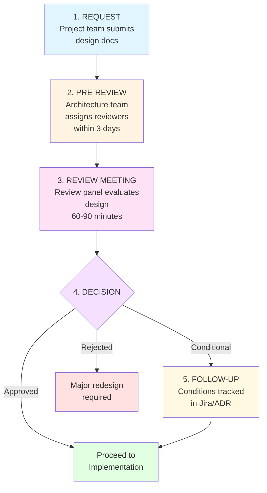

# Architecture Review Process

> **Version:** 1.1  
> **Date:** 2025-03-20  
> **Status:** Approved  
> **Author:** IT Architecture Team  
> **Owner:** Chief Architect  
> **Scope:** Global — All IT/OT infrastructure projects
> **Changelog:** v1.1 - Converted ASCII diagrams to Mermaid

---

## 1. Executive Summary

### 1.1 Purpose

The Architecture Review Process ensures that all significant infrastructure changes align with enterprise architecture principles, standards, and strategic objectives. This process provides:

- **Quality assurance** for technical designs before implementation
- **Risk mitigation** through early identification of architectural issues
- **Knowledge sharing** across architecture and engineering teams
- **Compliance validation** with security, regulatory, and operational standards
- **Cost optimization** by preventing technical debt and rework

### 1.2 Key Principles

**Collaborative, not bureaucratic:** Reviews are discussions between peers, not approval gates. The goal is to improve designs, not block progress.

**Early and iterative:** Engage architecture early in the design phase. Multiple lightweight reviews are better than one heavyweight review at the end.

**Evidence-based:** Decisions are based on documented trade-offs, not opinions. Architecture Decision Records (ADRs) capture the "why" behind choices.

**Context-aware:** Reviews consider project constraints (budget, timeline, skills) and plant-specific realities, not just theoretical best practices.

### 1.3 Scope

**In scope:**

- New infrastructure services or platforms
- Significant changes to existing production systems
- Technology evaluations and vendor selections
- Cross-department integrations
- Security architecture changes
- Disaster recovery and business continuity designs

**Out of scope (delegated to teams):**

- Routine configuration changes within established patterns
- Application-level code reviews (handled by development teams)
- Day-to-day operational changes
- Emergency fixes (post-incident review required)

---

## 2. When is a Review Required?

### 2.1 Mandatory Review Triggers

An Architecture Review is **mandatory** when any of the following conditions are met:

| Trigger                 | Examples                                              | Review Type               |
| ----------------------- | ----------------------------------------------------- | ------------------------- |
| **Budget threshold**    | CAPEX > €50,000 or OPEX > €20,000/year                | Formal review             |
| **New technology**      | First use of a vendor, platform, or protocol          | Formal review             |
| **Cross-plant impact**  | Change affects >1 plant or corporate network          | Formal review             |
| **Security impact**     | Changes to firewall rules, authentication, encryption | Security-focused review   |
| **OT/IT boundary**      | Any change crossing Purdue model levels               | OT security review        |
| **Data classification** | Handling of Platinum or Gold tier data                | Compliance-focused review |
| **Vendor lock-in risk** | Proprietary protocols or formats                      | Strategic review          |
| **DR/BCP impact**       | Changes to backup, replication, or failover           | Resilience review         |

### 2.2 Recommended (but Optional) Reviews

Reviews are **recommended** for:

- Proof-of-concept (PoC) designs before pilot deployment
- Post-incident architectural changes
- Annual review of critical services (health check)
- Adoption of new open-source components
- Changes to monitoring or alerting architecture

### 2.3 Exemptions

The following do **not** require review:

- Application of existing architecture patterns (e.g., deploying another VM using standard template)
- Security patches and vendor-recommended updates
- Capacity expansions within planned scaling limits
- Routine backup restores or failover tests

**Note:** When uncertain whether a review is needed, contact the Architecture Team. A 15-minute consultation can clarify if a formal review is warranted.

---

## 3. Review Process

### 3.1 Process Overview

**Timeline:** Typical process takes **10 business days** from submission to decision.

### 3.2 Step-by-Step Process

#### Step 1: Request Submission (Project Team)

**Timeline:** Submit at least **2 weeks before** planned implementation.

**Required materials:**

1. **Architecture Review Request Form** (see Appendix A)
   
   - Project overview (business justification, scope)
   - Architecture diagram (C4 model Level 2 minimum)
   - Technology choices with rationale
   - Risk assessment (technical, security, operational)

2. **Design Document** (using standard template)
   
   - Current state (if applicable)
   - Proposed architecture
   - Alternatives considered (with trade-offs)
   - Cost estimate (CAPEX/OPEX)
   - Implementation plan

3. **Architecture Decision Records (ADRs)** (for significant choices)
   
   - Why was technology X chosen over Y?
   - What trade-offs were made?

**Submission:** Email to `architecture-review@company.com` with:

- Subject: `[ARCH REVIEW] <Project Name> - <Plant/Department>`
- Attachments: All required documents
- Requested review date (2+ weeks out)

#### Step 2: Pre-Review (Architecture Team)

**Timeline:** Within **3 business days** of submission.

**Activities:**

- Assign lead reviewer (based on domain expertise)
- Assign 2-3 panel members (mix of architects, security, operations)
- Review materials for completeness
- Identify red flags or areas requiring deep dive
- Schedule review meeting (60-90 minutes)

**Output:** Meeting invite + pre-review comments sent to project team.

#### Step 3: Review Meeting

**Timeline:** Scheduled within **10 business days** of submission.

**Participants:**

- **Presenters:** Project lead + technical lead (2-3 people max)
- **Review panel:** Lead reviewer + 2-3 architects/SMEs
- **Optional observers:** Security, compliance, management (listen only)

**Agenda (60-90 minutes):**

1. **Project context** (5 min)
   
   - Business problem and objectives
   - Success criteria

2. **Architecture walkthrough** (15 min)
   
   - High-level design (use diagrams)
   - Technology choices
   - Integration points

3. **Deep dive on key decisions** (20 min)
   
   - Why this approach vs. alternatives?
   - How does it handle failure scenarios?
   - Operational considerations (monitoring, updates, support)

4. **Q&A and discussion** (15 min)
   
   - Panel asks clarifying questions
   - Probe assumptions and risks

5. **Deliberation** (10 min)
   
   - Presenters step out
   - Panel discusses and reaches consensus

6. **Decision and feedback** (5 min)
   
   - Present decision: Approved / Conditional / Rejected
   - Provide actionable feedback

**Meeting style:**

- Collaborative, not adversarial
- Focus on learning and improvement
- Respectful challenge of assumptions
- Document concerns, not just outcomes

#### Step 4: Decision

The review panel can reach one of three outcomes:

**✅ APPROVED**

- Design meets all architecture standards
- No significant concerns raised
- Project can proceed to implementation

**⚠️ CONDITIONAL APPROVAL**

- Design is generally sound but has minor gaps
- Specific conditions must be met before implementation
- Examples:
  - "Approved pending security team sign-off on firewall rules"
  - "Approved with requirement to add monitoring for X metric"
  - "Approved if vendor provides SLA commitment in writing"

**❌ REJECTED**

- Significant architectural flaws or risks
- Does not align with enterprise standards
- Project team must revise and resubmit
- Rare outcome — usually only for severe issues

**Decision criteria:**

- Alignment with enterprise architecture principles
- Technical feasibility and soundness
- Security and compliance posture
- Operational supportability
- Cost-effectiveness and ROI
- Risk level (acceptable vs. unacceptable)

#### Step 5: Follow-Up

**Timeline:** Within **2 business days** of review.

**Activities:**

1. **Document decision**
   
   - Update Architecture Review Request with outcome
   - Create Jira ticket for conditions (if applicable)
   - File ADRs in architecture repository

2. **Track conditions**
   
   - Conditional approvals tracked in Jira
   - Architecture team reviews evidence of completion
   - Final sign-off before production deployment

3. **Post-implementation review** (for major projects)
   
   - 30-60 days after go-live
   - Lessons learned: What went well? What didn't?
   - Update architecture patterns based on learnings

---

## 4. Review Panel Composition

### 4.1 Core Roles

| Role                          | Responsibility                                                | Selection                                                 |
| ----------------------------- | ------------------------------------------------------------- | --------------------------------------------------------- |
| **Lead Reviewer**             | Facilitates meeting, synthesizes feedback, documents decision | Senior architect with domain expertise                    |
| **Architecture SME #1**       | Evaluates technical design, identifies risks                  | Architect from related domain                             |
| **Architecture SME #2**       | Provides alternative perspectives                             | Architect from different domain (cross-pollination)       |
| **Security Representative**   | Assesses security posture, compliance                         | Security architect (mandatory for OT/IT boundary changes) |
| **Operations Representative** | Validates operational feasibility                             | SRE or Ops lead (for production systems)                  |

### 4.2 Optional Participants

- **Business stakeholder:** For strategic projects (budget > €200k)
- **Compliance officer:** For projects handling financial or PII data
- **Vendor representative:** For vendor-proposed solutions (listen only, Q&A)

### 4.3 Panel Independence

**Conflict of interest:** Panel members cannot review projects where they are:

- Project team members
- Direct managers of project team
- Vendors or consultants with financial interest

**Diversity:** Panels should include at least one member who is NOT from the same department as the project team (avoid echo chambers).

---

## 5. Architecture Principles (Review Criteria)

Designs are evaluated against the following principles:

### 5.1 Security & Compliance

- **Least privilege:** Systems and users have minimum necessary permissions
- **Defense in depth:** Multiple layers of security controls
- **Data protection:** Encryption at rest and in transit for sensitive data
- **Audit logging:** All access and changes are logged
- **Purdue model compliance:** OT/IT segregation maintained (industrial environments)

### 5.2 Resilience & Reliability

- **No single points of failure:** Critical components are redundant
- **Graceful degradation:** System continues operating (possibly reduced capacity) when components fail
- **Disaster recovery:** Defined RPO/RTO with tested recovery procedures
- **Monitoring and alerting:** Proactive detection of issues before user impact

### 5.3 Scalability & Performance

- **Horizontal scalability:** Can scale out by adding instances (not just scale up)
- **Performance budgets:** Defined latency/throughput SLAs
- **Capacity planning:** Growth projections for 3-5 years
- **Efficient resource usage:** Right-sized infrastructure (not over-provisioned)

### 5.4 Operational Excellence

- **Automation first:** Manual processes are exception, not norm
- **Observability:** Metrics, logs, and traces enable troubleshooting
- **Runbook documentation:** Clear procedures for common operations
- **Supportability:** On-call team can diagnose and remediate issues

### 5.5 Cost Optimization

- **TCO analysis:** 3-5 year total cost of ownership (not just CAPEX)
- **Decommissioning plan:** How to retire the system when no longer needed
- **Avoid vendor lock-in:** Use open standards where possible
- **Pay-as-you-grow:** Start small, scale incrementally

### 5.6 Standards & Consistency

- **Reuse existing patterns:** Don't reinvent the wheel
- **Consistency:** Similar problems solved similarly across plants
- **Technology radar:** Align with enterprise technology strategy
- **Interoperability:** Systems integrate via standard APIs

---

## 6. Common Review Topics (Deep Dive Areas)

### 6.1 Technology Selection

**Key questions:**

- Why this vendor/product over alternatives?
- What is the vendor's market position and longevity?
- Is there a proprietary lock-in risk?
- What is the total cost (license + support + training + integration)?
- Do we have in-house skills, or do we need training/hiring?

**Red flags:**

- "We chose X because it's popular" (no technical justification)
- Single-vendor dependency for critical function
- Immature technology (< 2 years in market)
- No clear migration path if vendor fails

### 6.2 Integration Architecture

**Key questions:**

- How does this system integrate with existing systems?
- What protocols/APIs are used? Are they standard or proprietary?
- What happens if integration partner is unavailable?
- How are API changes managed (versioning)?

**Red flags:**

- Point-to-point integrations (spaghetti architecture)
- Synchronous calls without timeouts/retries
- No error handling or circuit breakers
- Tight coupling (changes to one system break others)

### 6.3 Data Architecture

**Key questions:**

- What data is stored, and what is its classification (Platinum/Gold/Silver/Bronze)?
- Where is data stored (on-premise, cloud, edge)?
- How is data backed up? What are RPO/RTO?
- Is PII or financial data involved? What compliance requirements apply?

**Red flags:**

- No data lifecycle management (retention policies)
- Sensitive data stored unencrypted
- No data sovereignty considerations (GDPR)
- Unclear data ownership

### 6.4 Security Architecture

**Key questions:**

- What is the threat model?
- How is authentication/authorization handled?
- Are there any inbound connections from untrusted networks?
- How are secrets managed (passwords, API keys)?

**Red flags:**

- Default credentials not changed
- Lack of network segmentation
- Missing security patching strategy
- No penetration testing planned

### 6.5 Operational Architecture

**Key questions:**

- How is the system monitored (metrics, logs, alerts)?
- What is the deployment process (CI/CD)?
- How are updates applied (zero-downtime or planned outage)?
- Who is on-call for this system?

**Red flags:**

- No monitoring (flying blind)
- Manual deployment process
- No rollback plan
- Unclear ownership (no team assigned)

---

## 7. Documentation Requirements

### 7.1 Minimum Required Documents

Every architecture review must include:

1. **Architecture Diagram** (C4 Model Level 2)
   
   - Context: How does the system fit in the enterprise?
   - Containers: What are the major components (services, databases, etc.)?
   - Use Mermaid or draw.io (not hand-drawn sketches)

2. **Design Document** (Template provided)
   
   - Problem statement
   - Requirements (functional + non-functional)
   - Proposed solution
   - Alternatives considered
   - Risks and mitigations

3. **Architecture Decision Records (ADRs)** (for key decisions)
   
   - Document the "why" behind choices
   - Format: Context, Decision, Consequences
   - Stored in Git repository

### 7.2 Recommended Additional Documents

For complex projects, also provide:

- **Data flow diagrams** (how data moves through the system)
- **Sequence diagrams** (interaction between components)
- **Deployment diagram** (infrastructure topology)
- **Cost model** (breakdown of CAPEX/OPEX)
- **Runbooks** (operational procedures)

### 7.3 Documentation Standards

**Diagrams:**

- Use standard notation (C4, UML, or well-known conventions)
- Include legend/key
- Use consistent colors and shapes
- Export as PNG or SVG (not proprietary formats)

**Text:**

- Use Markdown for version control
- Maximum 10 pages (excluding appendices)
- Clear headings and structure
- Avoid jargon (explain acronyms)

---

## 8. Roles and Responsibilities (RACI)

### 8.1 Architecture Review Governance

| Activity                   | Chief Architect | Lead Reviewer | Panel Members | Project Team | Security | Operations |
| -------------------------- | --------------- | ------------- | ------------- | ------------ | -------- | ---------- |
| **Define review process**  | **A** R         | C             | C             | I            | C        | C          |
| **Assign reviewers**       | A               | **R**         | I             | I            | I        | I          |
| **Submit review request**  | I               | I             | I             | **R** A      | I        | I          |
| **Pre-review materials**   | I               | **R** A       | C             | C            | C        | C          |
| **Conduct review meeting** | I               | **R** A       | **R**         | C            | C        | C          |
| **Document decision**      | I               | **R** A       | C             | I            | I        | I          |
| **Track conditions**       | I               | **R**         | C             | A            | C        | C          |
| **Post-impl review**       | I               | **R** A       | C             | C            | I        | **R**      |

**Legend:** R = Responsible, A = Accountable, C = Consulted, I = Informed

### 8.2 Escalation Path

If consensus cannot be reached or project team disagrees with decision:

1. **Level 1:** Lead reviewer + project lead discuss offline (target: 48 hours)
2. **Level 2:** Chief Architect mediates (target: 1 week)
3. **Level 3:** CTO makes final decision (rare, reserved for strategic conflicts)

**Note:** Escalation is not a failure; it's a mechanism to resolve legitimate disagreements. Both parties should provide written justification for their position.

---

## 9. Metrics and Continuous Improvement

### 9.1 Key Metrics

Track the following to measure review process health:

| Metric                        | Target                                         | Purpose                                                    |
| ----------------------------- | ---------------------------------------------- | ---------------------------------------------------------- |
| **Time-to-review**            | < 10 business days (submission to decision)    | Ensure reviews don't block progress                        |
| **Conditional approval rate** | 40-60%                                         | Too low = rubber stamp; too high = too strict              |
| **Rejection rate**            | < 10%                                          | Rejections should be rare (early engagement prevents this) |
| **Post-impl issues**          | < 5% of reviewed projects have major incidents | Reviews should catch issues                                |
| **Satisfaction score**        | > 8/10 (project team survey)                   | Process should add value, not frustration                  |

### 9.2 Quarterly Review

The Architecture Team conducts a quarterly retrospective:

**Questions:**

- What reviews went well? What didn't?
- Are we catching the right issues?
- Are review times acceptable?
- What patterns are emerging (common mistakes)?
- How can we improve the process?

**Output:** Update process documentation, create new patterns/templates, training for teams.

---

## 10. Templates and Tools

### 10.1 Required Templates

The following templates are available in the architecture repository:

1. **Architecture Review Request Form** (see Appendix A)
2. **Design Document Template** (see Appendix B)
3. **Architecture Decision Record (ADR) Template** (see Appendix C)
4. **Review Checklist** (see Appendix D)

**Location:** `https://architecture.company.com/templates/`

### 10.2 Recommended Tools

- **Diagrams:** Mermaid (version controlled), draw.io, Lucidchart
- **ADRs:** Git repository (Markdown files)
- **Project tracking:** Jira (track conditions, follow-ups)
- **Knowledge base:** Confluence (archive review decisions, patterns)

---

## 11. Training and Onboarding

### 11.1 For Project Teams

**Before first review:**

- Read this process document
- Review 2-3 past architecture review examples (anonymized)
- Attend "Preparing for Architecture Review" workshop (quarterly)

**Resources:**

- Recorded review sessions (with permission)
- Architecture patterns library
- ADR examples

### 11.2 For Reviewers

**Qualifications:**

- Senior architect (5+ years experience)
- Deep expertise in one domain + broad knowledge across domains
- Strong communication skills (constructive feedback)

**Training:**

- Shadow 3 reviews before leading
- Review facilitation techniques
- Bias awareness (avoid "not invented here" syndrome)

---

## 12. Appendices

### Appendix A: Architecture Review Request Form

*See separate document: `architecture-review-request-template.md`*

### Appendix B: Design Document Template

*See separate document: `design-document-template.md`*

### Appendix C: Architecture Decision Record (ADR) Template

*See separate document: `adr-template.md`*

### Appendix D: Review Checklist

*See separate document: `architecture-review-checklist.md`*

---

## 13. References

- **C4 Model:** https://c4model.com/
- **Architecture Decision Records:** https://adr.github.io/
- **TOGAF (The Open Group Architecture Framework):** https://www.opengroup.org/togaf
- **AWS Well-Architected Framework:** https://aws.amazon.com/architecture/well-architected/
- **Google SRE Book (Chapter on Design Reviews):** https://sre.google/sre-book/evolving-sre-engagement-model/

---

## 14. Approvals

| Role                | Name   | Signature | Date       |
| ------------------- | ------ | --------- | ---------- |
| **CTO**             | [Name] | ✅         | 2025-03-20 |
| **Chief Architect** | [Name] | ✅         | 2025-03-20 |
| **CISO**            | [Name] | ✅         | 2025-03-20 |

---

## 15. Change History

| Version | Date       | Author          | Changes                                                  |
| ------- | ---------- | --------------- | -------------------------------------------------------- |
| 1.0     | 2025-03-20 | IT Architecture | Initial version — Architecture Review Process            |
| 1.1     | 2025-03-20 | IT Architecture | Converted ASCII diagrams to Mermaid for better rendering |

---

**Contact:** architecture-review@company.com  
**Wiki:** https://architecture.company.com/review-process/
