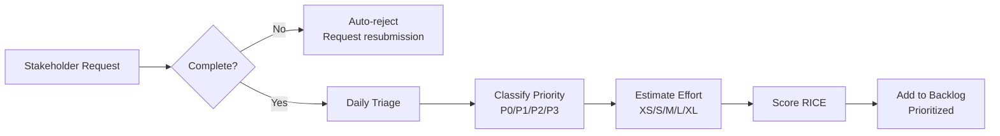

# Architecture Team Demand Management — Complete Package

> **Version:** 1.0  
> **Last Updated:** 2025-03-20  
> **Owner:** IT Architecture Team

---

## 🎯 The Problem This Solves

**Small architecture teams face universal challenges:**

😰 **Unlimited demand** vs limited capacity (everything is "urgent")  
🔥 **Stakeholder pressure** ("My project is blocked!")  
🤹 **Context switching** (interruptions kill productivity)  
📝 **Incomplete documentation** (rush to next request before finishing)  
💔 **Burnout risk** (weekends to catch up)  

**This package provides a complete solution.**

---

## 📦 What's in This Package?

This package provides a production-ready demand management system with 3 core documents:

| Document | Purpose | Audience | Pages |
|----------|---------|----------|-------|
| **demand-management-prioritization.md** | Complete process: intake, scoring, WIP limits, DoD | All teams | 25 |
| **kanban-board-guide.md** | Visual board setup, daily operations, metrics | Architecture team | 12 |
| **stakeholder-communication-playbook.md** | Scripts for handling pressure, saying "no" gracefully | Architecture team | 17 |

**Total:** 54 pages of actionable guidance.

---

## 🚀 Quick Start

### For Architecture Team Leaders

**Week 1-2: Setup**
1. Read `demand-management-prioritization.md` (Section 1-5)
2. Create intake form (email or Jira)
3. Set up Kanban board (use `kanban-board-guide.md`)
4. Announce new process to stakeholders

**Week 3-6: Pilot**
1. Route all requests through intake
2. Score and prioritize existing backlog (RICE)
3. Set WIP limit to 3
4. Practice communication scripts from `stakeholder-communication-playbook.md`
5. Retrospective after 4 weeks

**Week 7+: Optimize**
1. Track metrics (lead time, throughput, satisfaction)
2. Refine RICE criteria based on learnings
3. Quarterly business reviews with executives

### For Stakeholders (Submitting Requests)

**How to get your request prioritized:**
1. Submit via `architecture-requests@company.com` or Jira form
2. Include business justification and impact
3. Accept realistic timelines (typically 2-4 weeks)
4. For urgent needs, escalate with data (not just "urgent")

**What to expect:**
- Acknowledgment within 1 business day
- Clear timeline and queue position
- Weekly status updates
- Transparent prioritization (you can see the queue)

---

## 🧭 Core System Components

### 1. Intake Process (Single Point of Entry)



**Key principle:** ALL requests go through intake (no hallway requests, no DMs to architects).

---

### 2. RICE Prioritization

**For competing requests, use objective scoring:**

**RICE = (Reach × Impact × Confidence) / Effort**

| Factor | Scale | Example |
|--------|-------|---------|
| **Reach** | 1-10 (people/plants affected) | 10 = all plants, 1 = single plant |
| **Impact** | 1-5 (improvement magnitude) | 5 = massive, 1 = minimal |
| **Confidence** | 0.5-1.0 (certainty) | 1.0 = high, 0.5 = low |
| **Effort** | 1-8 (person-weeks) | 8 = 2 months, 1 = 1 week |

**Higher RICE score = Higher priority**

---

### 3. Work in Progress (WIP) Limits

**For a 3-person team:**

| Status | WIP Limit | Why |
|--------|-----------|-----|
| **In Progress** | **3 items** | 1 per person (prevents context switching) |
| **In Review** | 2 items | Waiting for feedback |

**Pull-based system:** Only start new work when capacity frees up (don't push).

**Benefits:**
- ✅ Faster completion (focus beats multitasking)
- ✅ Less context switching (20-30% productivity gain)
- ✅ Visible progress (stakeholders see Done column growing)
- ✅ Sustainable pace (prevents burnout)

---

### 4. Definition of Done (Prevents Incomplete Work)

**Work is "Done" when ALL checkboxes complete:**

For **Design Documents:**
- [ ] All sections complete (no TODOs)
- [ ] Diagrams included (C4 Level 2 minimum)
- [ ] Peer reviewed (another architect)
- [ ] Stakeholder approved (business owner signs off)
- [ ] Published to wiki (accessible)
- [ ] Announced to teams (email, Slack)

**No partial credit:** 90% done = 0% done for planning purposes.

---

### 5. Kanban Board (Visual Queue)

```
┌─────────────┬────────────┬─────────────┬──────────┬────────┐
│   BACKLOG   │   READY    │ IN PROGRESS │ IN REVIEW│  DONE  │
│             │            │             │          │        │
│ [30 items]  │ [5 items]  │   [3 items] │ [2 items]│ [120]  │
│ Prioritized │ Next up    │   WIP=3     │ Waiting  │Archive │
│ by RICE     │            │   Active    │ feedback │        │
└─────────────┴────────────┴─────────────┴──────────┴────────┘
```

**Public access:** Stakeholders can view (read-only) to see queue position.

---

## 💬 Handling Stakeholder Pressure

### Common Scenarios & Scripts

**Scenario 1: "Can you just squeeze this in?"**

**✅ Good Response:**
> "I'd love to help. Our WIP limit is 3 to ensure quality. We're working on:
> 1. [Project A] (done Apr 5)
> 2. [Project B] (done Apr 8)
> 3. [Project C] (done Apr 12)
> 
> Would you like to:
> A) Schedule as next in queue (start Apr 13)
> B) Escalate if this is blocking something critical
> C) Quick consultation now (< 30 min)"

**Why it works:** Shows queue, offers options, transparent.

---

**Scenario 2: "This is urgent!"**

**✅ Good Response:**
> "I understand this is important. Let me show our prioritization:
> 
> Your request: RICE 6.5 (affects 3 plants)
> Current P1: RICE 12.5 (affects 10 plants)
> 
> If yours truly can't wait, let's escalate to [Chief Architect] with business justification. Or can we break into phases?"

**Why it works:** Objective criteria, escalation path, compromise option.

---

### De-escalation Techniques

1. **"Let's Get Curious"**
   - Instead of: "That's not realistic"
   - Say: "Help me understand why this deadline is critical"

2. **"Make Constraints Visible"**
   - Instead of: "We can't do that"
   - Say: "Here's our 150h capacity. Here's 140h committed. Yours needs 30h. What should we pause?"

3. **"Offer Multiple Options"**
   - Never just "no" — always offer alternatives

**Full playbook:** See `stakeholder-communication-playbook.md`

---

## 📊 Metrics to Track

### Key Metrics

| Metric | Target | Purpose |
|--------|--------|---------|
| **Lead Time** (request → done) | < 21 days (P2) | Responsiveness |
| **Cycle Time** (start → done) | < 7 days (P2) | Efficiency |
| **Throughput** (items/month) | 8-10 baseline | Capacity |
| **WIP Age** (days in progress) | < 14 days | Prevent stale work |
| **Stakeholder Satisfaction** | > 8/10 | Value delivery |

**Track monthly** → Identify trends → Continuous improvement

---

## 🎓 Implementation Roadmap

### Phase 1: Setup (Week 1-2)

- [ ] Create intake form (Jira or email template)
- [ ] Set up Kanban board (Backlog, Ready, In Progress, Review, Done)
- [ ] Document RICE criteria
- [ ] Announce to stakeholders (email, town hall)

### Phase 2: Pilot (Week 3-6)

- [ ] Route all requests through intake
- [ ] Score existing backlog (RICE)
- [ ] Set WIP limit = 3
- [ ] Send weekly status emails
- [ ] Retrospective after 4 weeks

### Phase 3: Optimize (Week 7-12)

- [ ] Refine RICE based on learnings
- [ ] Implement Definition of Done
- [ ] Track metrics
- [ ] Quarterly business review

### Phase 4: Scale (Month 4+)

- [ ] Train new team members
- [ ] Automate reporting
- [ ] Continuous improvement

---

## ✅ Success Criteria

**You'll know this is working when:**

✅ Team works normal hours (no regular overtime)  
✅ Stakeholders see queue (no "status check" emails)  
✅ Work gets finished (not 10 things 80% done)  
✅ Prioritization is transparent (stakeholders accept "not now")  
✅ Documentation is complete (no incomplete work)  
✅ Team feels in control (not overwhelmed)  
✅ Satisfaction scores remain high (> 8/10)  

---

## 📚 Document Summaries

### 1. demand-management-prioritization.md (25 pages)

**Complete process definition covering:**

**Section 1-2:** Problem, solution, principles  
**Section 3:** RICE prioritization (Reach, Impact, Confidence, Effort)  
**Section 4:** Effort estimation (T-shirt sizing, capacity planning)  
**Section 5:** WIP limits (why, how, enforcement)  
**Section 6:** Definition of Done (preventing incomplete work)  
**Section 7:** Calendar and roadmap (quarterly planning)  
**Section 8:** Stakeholder communication (managing expectations)  
**Section 9:** Escalations (when stakeholders disagree)  
**Section 10:** Preventing burnout (sustainable pace)  
**Section 11:** Metrics (lead time, cycle time, throughput)  
**Section 12:** Tools (Jira, Trello, templates)  
**Section 13:** Implementation plan (4 phases)  
**Section 14:** FAQ  
**Appendices:** Intake form, RICE template, roadmap template, email templates

---

### 2. kanban-board-guide.md (12 pages)

**Visual board setup and operations:**

**Section 1:** Board structure (5 columns with Mermaid diagram)  
**Section 2:** Card template (what info to display)  
**Section 3:** Daily operations (standup, WIP enforcement, card movement)  
**Section 4:** Bi-weekly planning (scoring, prioritization, capacity)  
**Section 5:** Metrics dashboard (lead time, cycle time, throughput)  
**Section 6:** Common scenarios (handling pressure, stuck cards, P0s)  
**Section 7:** Tools setup (Jira, Trello configuration)  
**Section 8:** Physical board setup (if using whiteboard)  
**Section 9:** Best practices (do's and don'ts)  
**Section 10:** Success checklist

---

### 3. stakeholder-communication-playbook.md (17 pages)

**Scripts and strategies for difficult conversations:**

**Section 1:** Core principles (transparency, empathy, firmness)  
**Section 2:** 8 common scenarios with bad vs good responses:
- "Can you just squeeze this in?"
- "This is urgent!"
- "Why isn't this done yet?"
- "My boss says this is top priority"
- "Can't you just work overtime?"
- "I'll just do it myself then"
- "This will only take 5 minutes"
- "You're blocking my project"

**Section 3:** Email templates (acknowledgment, status, pushback)  
**Section 4:** Meeting scripts (prioritization discussions, saying no)  
**Section 5:** De-escalation techniques  
**Section 6:** Building credibility  
**Section 7:** Success indicators  
**Section 8:** Red flags (warning signs)

---

## 🛠️ Tools & Templates

### Included Templates

All templates are in the Appendices:

- **Request Intake Form** (captures all necessary info)
- **RICE Scoring Template** (Excel/Google Sheets)
- **Quarterly Roadmap Template** (strategic planning)
- **Weekly Status Email Template** (stakeholder communication)

### Recommended Tools

| Tool | Purpose |
|------|---------|
| **Jira** | Backlog, Kanban board, reporting |
| **Trello** | Simple alternative to Jira |
| **Confluence** | Documentation, roadmaps |
| **Slack** | Communication (#architecture-requests channel) |
| **Google Sheets** | RICE scoring, capacity planning |

---

## 🌟 Best Practices from Industry

This package incorporates proven methods from:

**ITIL (IT Service Management):**
- Service Request Management
- Demand management

**DevOps/Lean:**
- Kanban (pull-based, WIP limits)
- Continuous flow
- Metrics-driven improvement

**Product Management:**
- RICE scoring (Intercom framework)
- MoSCoW prioritization
- Roadmap planning

**Architecture Governance:**
- TOGAF principles
- Architecture Review Boards
- Stakeholder management

---

## 📞 Getting Help

**Questions about this process?**
- Email: `architecture-team@company.com`
- Slack: `#architecture-requests`
- Office Hours: Thursdays 2-3pm

**Want to share learnings?**
- Contribute improvements back to the team
- Share success stories in retrospectives

---

## 🔄 Version History

| Version | Date | Changes |
|---------|------|---------|
| 1.0 | 2025-03-20 | Initial release — Complete demand management system |

---

## 📦 Package Contents

```
demand-management/
├── README.md (this file)                          — Overview and quick start
├── demand-management-prioritization.md (25 pages) — Complete process definition
├── kanban-board-guide.md (12 pages)               — Visual board setup & operations
└── stakeholder-communication-playbook.md (17 pages) — Scripts for difficult conversations
```

**Total:** 54 pages of production-ready guidance.

---

## 💡 Key Takeaways

**1. Process prevents chaos**
- Intake → Prioritization → WIP limits → Definition of Done
- Transparent, objective, sustainable

**2. Communication is critical**
- Show the queue, explain criteria, offer options
- Empathy + firmness = respect

**3. Metrics drive improvement**
- Track lead time, cycle time, throughput
- Continuous improvement every quarter

**4. Boundaries protect quality**
- WIP limits prevent context switching
- Definition of Done prevents incomplete work
- Sustainable pace prevents burnout

**5. Stakeholders are allies, not adversaries**
- Shared goal: deliver value sustainably
- Transparency builds trust

---

**Ready to implement?** Start with Phase 1 (Week 1-2) and iterate from there. Good luck! 🚀

---

**Maintained by:** IT Architecture Team  
**Owner:** Chief Architect  
**License:** Internal Use Only
