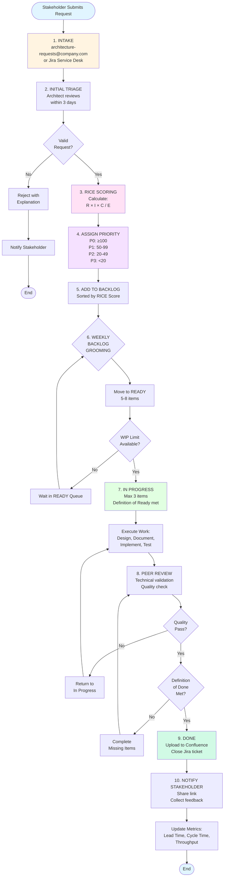
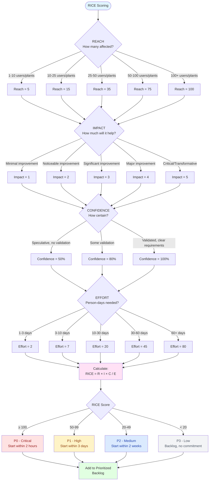
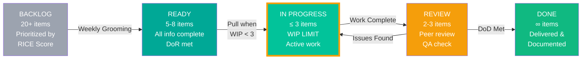
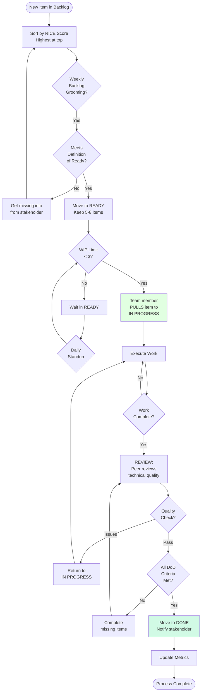
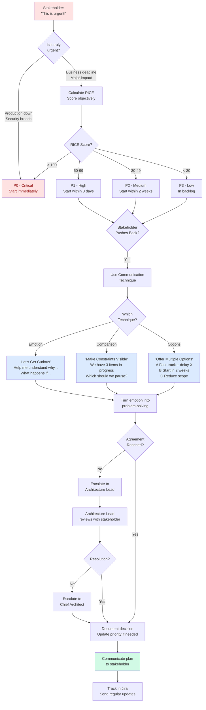
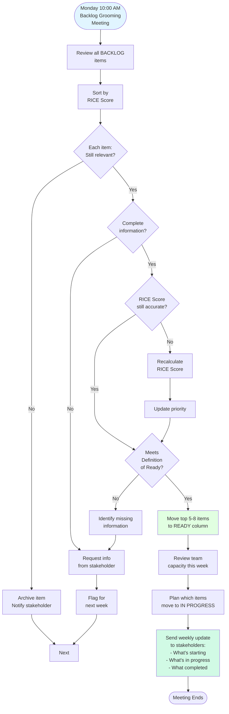
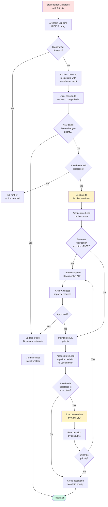
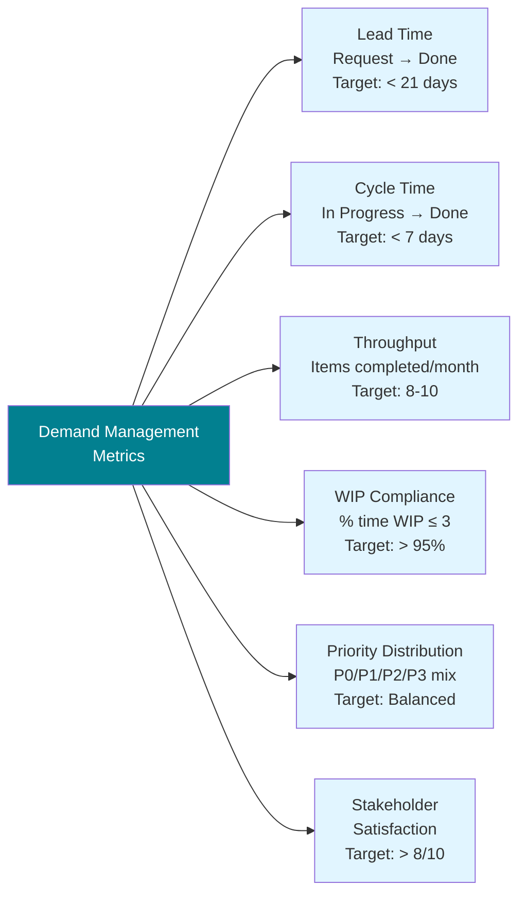
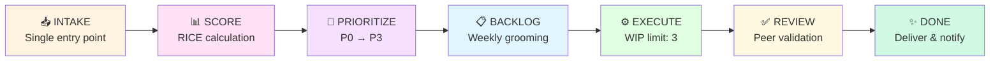

# Demand Management Process - Visual Diagrams

> **Version:** 1.0  
> **Date:** 2025-03-21  
> **Author:** IT Architecture Team  
> **Purpose:** Visual representation of the demand management process end-to-end

---

## Table of Contents

1. [Complete End-to-End Process](#1-complete-end-to-end-process)
2. [Intake and Triage Process](#2-intake-and-triage-process)
3. [RICE Scoring Decision Tree](#3-rice-scoring-decision-tree)
4. [Kanban Workflow](#4-kanban-workflow)
5. [Stakeholder Communication Flow](#5-stakeholder-communication-flow)
6. [Weekly Backlog Grooming](#6-weekly-backlog-grooming)
7. [Escalation Process](#7-escalation-process)

---

## 1. Complete End-to-End Process

This diagram shows the complete demand management process from request submission to completion.



---


## 2. Intake and Triage Process

Detailed view of the initial request handling.

```mermaid
graph TD
    A[Request Received] --> B{Source?}

    B -->|Email| C[architecture-requests@<br/>company.com]
    B -->|Jira| D[Jira Service Desk<br/>Request Form]

    C --> E[Auto-create<br/>Jira Ticket]
    D --> E

    E --> F[Assign to<br/>Architecture Team]

    F --> G[Architect Reviews<br/>within 3 days]

    G --> H{Complete<br/>Information?}

    H -->|No| I[Request More Info<br/>from Stakeholder]
    I --> J{Response<br/>Received?}
    J -->|No after 7 days| K[Close as<br/>Incomplete]
    J -->|Yes| G

    H -->|Yes| L{In Scope<br/>for Architecture<br/>Team?}

    L -->|No| M[Redirect to<br/>Appropriate Team]
    M --> N[Notify Stakeholder]

    L -->|Yes| O{Similar Request<br/>Already Exists?}

    O -->|Yes| P[Link to Existing<br/>Request/Documentation]
    P --> Q[Notify Stakeholder]

    O -->|No| R[Proceed to<br/>RICE Scoring]

    R --> S[Gather Scoring<br/>Information:<br/>Reach, Impact,<br/>Confidence, Effort]

    S --> T{Stakeholder<br/>Input Needed?}

    T -->|Yes| U[Schedule<br/>15-min Call]
    U --> V[Confirm Values]

    T -->|No| V
    V --> W[Calculate<br/>RICE Score]

    style A fill:#e1f5ff
    style W fill:#e1ffe1
```

---

## 3. RICE Scoring Decision Tree

How to calculate each component of RICE.



---

## 4. Kanban Workflow

Visual representation of the Kanban board states and transitions.



### Kanban Rules



---

## 5. Stakeholder Communication Flow

How we manage stakeholder expectations and pressure.



---

## 6. Weekly Backlog Grooming

The weekly process to keep the backlog healthy.



---

## 7. Escalation Process

When stakeholders disagree with prioritization decisions.



---

## Process Metrics Dashboard

Key metrics to track process health:



---

## Summary Flow

Simple high-level view for presentations:



---

## Legend

### Shapes

- **Rectangle**: Process step
- **Diamond**: Decision point
- **Rounded Rectangle**: Start/End
- **Parallelogram**: Input/Output

### Colors

- 🔵 **Blue**: Information/Input
- 🟡 **Yellow**: Review/Decision
- 🟢 **Green**: Completion/Success
- 🔴 **Red**: Critical/Urgent
- 🟣 **Purple**: Calculation/Processing

### Arrows

- **Solid**: Primary flow
- **Dashed**: Alternative/Exception flow

---

## How to Use These Diagrams

1. **For Presentations**: Use diagram #1 (Complete End-to-End) or Summary Flow
2. **For Training**: Use all diagrams in sequence
3. **For Reference**: Print diagram #4 (Kanban Workflow) and post near team workspace
4. **For Stakeholders**: Use diagram #5 (Stakeholder Communication Flow)
5. **For Weekly Meetings**: Use diagram #6 (Backlog Grooming)

---

**Document Control:**

- **Created**: 2025-03-21
- **Format**: Mermaid diagrams (compatible with GitHub, Confluence, GitLab, VS Code)
- **Related Documents**: 
  - Demand Management and Prioritization Process
  - Kanban Board Guide
  - Stakeholder Communication Playbook
