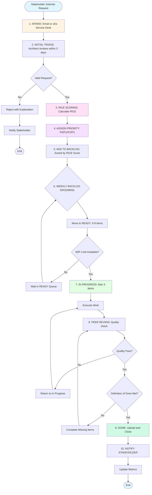
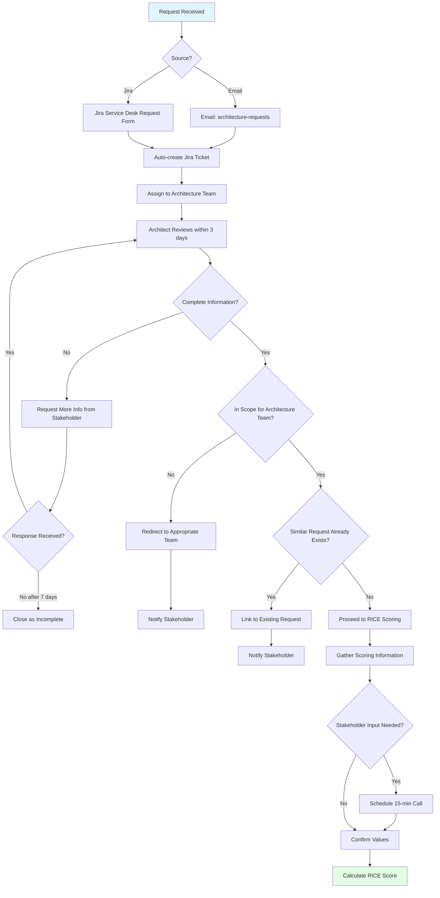
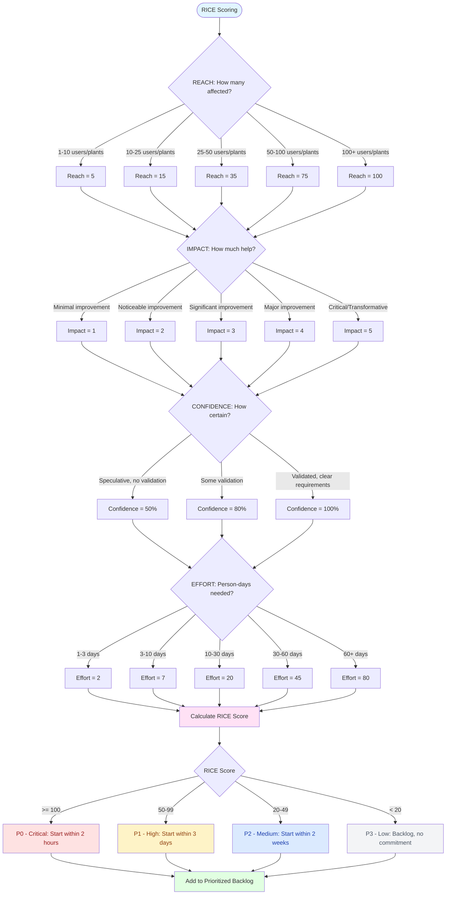
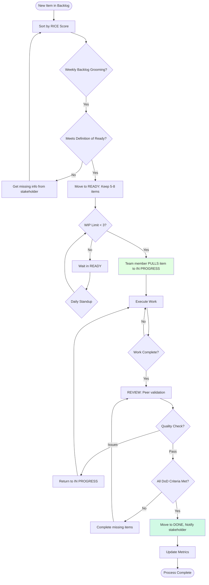
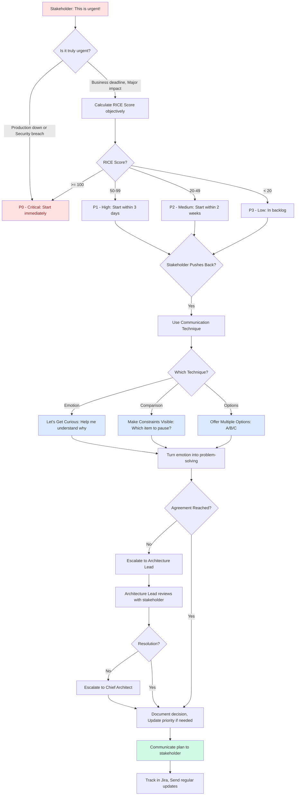
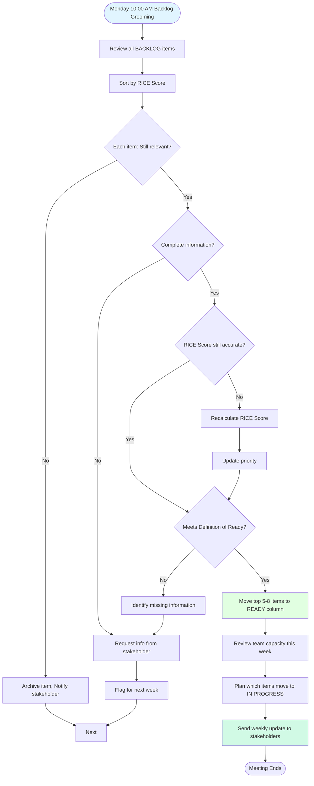
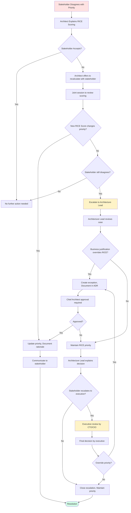
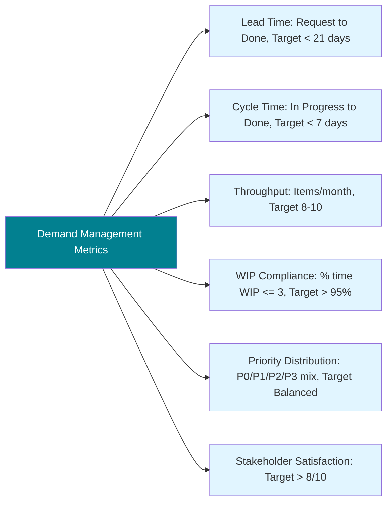
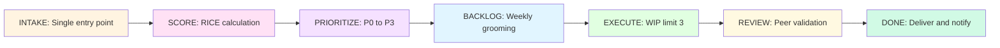

# Demand Management Process - Visual Diagrams

> **Version:** 1.1  
> **Date:** 2025-03-21  
> **Author:** IT Architecture Team  
> **Purpose:** Visual representation of the demand management process end-to-end  
> **Changelog:** v1.1 - Fixed Mermaid syntax for GitHub/GitLab compatibility (removed HTML tags and special characters)

---

## Table of Contents

1. [Complete End-to-End Process](https://claude.ai/chat/4aeb5a6e-5a42-4b83-b5aa-5aa1e8ae546c#1-complete-end-to-end-process)
2. [Intake and Triage Process](https://claude.ai/chat/4aeb5a6e-5a42-4b83-b5aa-5aa1e8ae546c#2-intake-and-triage-process)
3. [RICE Scoring Decision Tree](https://claude.ai/chat/4aeb5a6e-5a42-4b83-b5aa-5aa1e8ae546c#3-rice-scoring-decision-tree)
4. [Kanban Workflow](https://claude.ai/chat/4aeb5a6e-5a42-4b83-b5aa-5aa1e8ae546c#4-kanban-workflow)
5. [Stakeholder Communication Flow](https://claude.ai/chat/4aeb5a6e-5a42-4b83-b5aa-5aa1e8ae546c#5-stakeholder-communication-flow)
6. [Weekly Backlog Grooming](https://claude.ai/chat/4aeb5a6e-5a42-4b83-b5aa-5aa1e8ae546c#6-weekly-backlog-grooming)
7. [Escalation Process](https://claude.ai/chat/4aeb5a6e-5a42-4b83-b5aa-5aa1e8ae546c#7-escalation-process)

---

## 1. Complete End-to-End Process

This diagram shows the complete demand management process from request submission to completion.

---

## 2. Intake and Triage Process

Detailed view of the initial request handling.

---

## 3. RICE Scoring Decision Tree

How to calculate each component of RICE.

---

## 4. Kanban Workflow

Visual representation of the Kanban board states and transitions.

### Kanban Rules

---

## 5. Stakeholder Communication Flow

How we manage stakeholder expectations and pressure.

---

## 6. Weekly Backlog Grooming

The weekly process to keep the backlog healthy.

---

## 7. Escalation Process

When stakeholders disagree with prioritization decisions.

---

## Process Metrics Dashboard

Key metrics to track process health:

---

## Summary Flow

Simple high-level view for presentations:

---

## Legend

### Shapes

- **Rectangle**: Process step
- **Diamond**: Decision point
- **Rounded Rectangle**: Start/End
- **Parallelogram**: Input/Output (used in some diagrams)

### Colors

- 🔵 **Blue** (#e1f5ff): Information/Input
- 🟡 **Yellow** (#fff4e1, #fef3c7): Review/Decision
- 🟢 **Green** (#e1ffe1, #d1fae5): Completion/Success
- 🔴 **Red** (#fee2e2): Critical/Urgent
- 🟣 **Purple** (#f5e1ff, #ffe1f5): Calculation/Processing
- ⚫ **Gray** (#9ca3af): Backlog/Inactive

### Arrows

- **Solid arrow**: Primary flow
- **Labeled arrow**: Condition or action (e.g., "Yes", "No", "Pull when WIP < 3")

### Special Notations

- **WIP LIMIT**: Work In Progress constraints (max 3 concurrent items)
- **DoR**: Definition of Ready
- **DoD**: Definition of Done
- **RICE**: Reach × Impact × Confidence / Effort
  
  ---

**Document Control:**

- **Created**: 2025-03-21
- **Updated**: 2025-03-21 (v1.1 - GitHub compatibility fixes)
- **Format**: Mermaid diagrams (compatible with GitHub, Confluence, GitLab, VS Code)
- **Related Documents**:
  - Demand Management and Prioritization Process
  - Kanban Board Guide
  - Stakeholder Communication Playbook

---

## Troubleshooting Mermaid Rendering

### Common Issues and Solutions

**Problem: "Parse error on line X"**

- **Cause**: Special characters in labels (@, <, >, HTML tags)
- **Solution**: Use plain text without HTML tags or special characters

**Problem: Diagram doesn't render in GitHub**

- **Cause**: Mermaid syntax not supported by GitHub's version
- **Solution**: Test diagram at https://mermaid.live first
- **Tip**: Use simple labels, avoid complex formatting

**Problem: Arrows not connecting properly**

- **Cause**: Inconsistent node IDs or syntax errors
- **Solution**: Check that all node IDs match exactly (case-sensitive)

**Problem: Colors not showing**

- **Cause**: Some platforms don't support all Mermaid features
- **Solution**: Style definitions work in most renderers, but may display differently

### Best Practices for Mermaid Diagrams

1. **Keep labels short**: Use colons for additional context (e.g., "INTAKE: Single entry point")
2. **Avoid special characters**: Stick to alphanumeric + basic punctuation
3. **Test before committing**: Use https://mermaid.live to validate syntax
4. **Use consistent spacing**: Proper indentation helps readability
5. **Comment complex logic**: Add markdown notes above complex diagrams

### Alternative Export Options

If Mermaid rendering fails on your platform:

1. **Export as PNG**: Use https://mermaid.live → Edit → Export PNG
2. **Export as SVG**: Use https://mermaid.live → Edit → Export SVG
3. **Use screenshot**: Render in VS Code and take screenshot
4. **Convert to image**: Use mermaid-cli tool: `mmdc -i diagram.mmd -o diagram.png`

---
