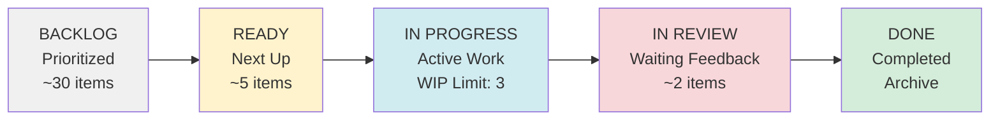

# Kanban Board Setup Guide

> **Purpose:** Visual guide to set up and operate the Architecture Team's Kanban board for demand management.

---

## 1. Board Structure

### 1.1 Columns (Left to Right)



### 1.2 Column Definitions

| Column | Purpose | Entry Criteria | Exit Criteria | WIP Limit |
|--------|---------|----------------|---------------|-----------|
| **BACKLOG** | All incoming requests, prioritized by RICE score | Request submitted and triaged | Pulled into Ready when capacity available | None |
| **READY** | Work that will be started soon (next 2 weeks) | High priority, all info available | Team member pulls into In Progress | 5 |
| **IN PROGRESS** | Active work being done now | Team member commits to work | All tasks complete, ready for review | **3** |
| **IN REVIEW** | Waiting for peer/stakeholder review | Work complete, review requested | Review approved | 2 |
| **DONE** | Completed work (Definition of Done met) | All checkboxes complete | Archived after 30 days | None |

---

## 2. Card Template

### 2.1 Card Information

Each card should display:

```
┌─────────────────────────────────────────┐
│ ARCH-123 [P1]                      [M]  │  ← Ticket ID, Priority, Size
├─────────────────────────────────────────┤
│ Kubernetes Standard for All Plants      │  ← Title
│                                          │
│ 👤 Maria González                       │  ← Assignee
│ 📅 Due: Apr 15                          │  ← Deadline
│ 🏢 Affects: 30 plants                   │  ← Impact
│                                          │
│ Status: 60% complete                    │  ← Progress
│ ⚠️ Blocked: Waiting security review     │  ← Blockers (if any)
└─────────────────────────────────────────┘
```

### 2.2 Color Coding

**By Priority:**
- 🔴 **P0 (Critical):** Red
- 🟠 **P1 (Urgent):** Orange
- 🟡 **P2 (Normal):** Yellow
- 🟢 **P3 (Low):** Green

**By Size:**
- 📏 **XS:** Mini card
- 📏 **S:** Small card
- 📏 **M:** Medium card
- 📏 **L:** Large card
- 📏 **XL:** Extra large card (consider breaking down)

---

## 3. Daily Operations

### 3.1 Daily Standup (15 minutes)

**Format:** Walk the board from right to left (Done → In Progress → Ready)

**For each card in IN PROGRESS:**
1. **What was completed yesterday?**
2. **What will be done today?**
3. **Any blockers?**

**Actions:**
- Move completed cards to IN REVIEW or DONE
- Escalate blockers (assign owner to resolve)
- Pull new cards from READY if capacity available

### 3.2 WIP Limit Enforcement

**Rule:** Never exceed 3 cards in IN PROGRESS.

**If someone wants to start new work:**
```
❌ BAD: "I'll just start this small task while waiting for review"
   → Result: 4 cards in progress, context switching, nothing finishes

✅ GOOD: "Let me help [teammate] finish their card first"
   → Result: Cards move to Done faster, WIP stays at 3
```

**Exception:** P0 critical issues can violate WIP limit temporarily (must restore limit within 24h).

### 3.3 Card Movement Rules

**BACKLOG → READY:**
- Only move during bi-weekly planning
- Pull highest RICE score items
- Ensure all information is available (no unknowns)

**READY → IN PROGRESS:**
- Pull-based (team member pulls when ready)
- Only if WIP < 3
- Assign to yourself (clear ownership)

**IN PROGRESS → IN REVIEW:**
- All tasks in card complete
- Review requested from peer/stakeholder
- Set deadline for review (e.g., "Review by Apr 10")

**IN REVIEW → DONE:**
- All reviews approved
- Definition of Done checklist complete
- Work published and announced

**IN REVIEW → IN PROGRESS:**
- Review feedback requires rework
- Assign back to original owner
- Prioritize finishing over starting new work

---

## 4. Bi-Weekly Planning (1 hour)

### 4.1 Agenda

**1. Review metrics (10 min):**
- How many items completed last 2 weeks?
- Average lead time?
- Any items stuck > 14 days?

**2. Celebrate wins (5 min):**
- Call out completed work
- Recognize team efforts

**3. Retrospect issues (10 min):**
- What slowed us down?
- What should we change?

**4. Prioritize backlog (20 min):**
- Re-score RICE if new information
- Reorder backlog by priority
- Identify dependencies

**5. Pull into READY (15 min):**
- Pull ~5 items into READY (enough for 2 weeks)
- Confirm information is complete
- Assign preliminary owners

### 4.2 Capacity Planning

**Estimate team capacity for next 2 weeks:**
```
Team: 3 people × 40 hours/week × 2 weeks = 240 hours
Meetings/admin: -20% = 192 hours
Buffer for urgents: -20% = 154 hours planned capacity

Available for planned work: ~150 hours

Only pull work that fits in 150 hours.
```

---

## 5. Metrics Dashboard

### 5.1 Key Metrics to Track

**Lead Time:**
```
Lead Time = Date card entered DONE - Date card entered BACKLOG

Target: < 21 days (P2)
```

**Cycle Time:**
```
Cycle Time = Date card entered DONE - Date card entered IN PROGRESS

Target: < 7 days (P2)
```

**Throughput:**
```
Throughput = Number of cards completed per sprint (2 weeks)

Baseline: Track for 3 sprints, then use as forecast
```

**WIP Age:**
```
WIP Age = Days since card entered IN PROGRESS

Alert if: Any card > 14 days in IN PROGRESS
```

### 5.2 Monthly Report Template

**Architecture Team - March 2025 Metrics**

| Metric | Mar 2025 | Feb 2025 | Target | Trend |
|--------|----------|----------|--------|-------|
| **Lead Time (avg)** | 18 days | 22 days | < 21 days | ⬇️ Improving |
| **Cycle Time (avg)** | 6 days | 8 days | < 7 days | ⬇️ Improving |
| **Throughput** | 9 items | 7 items | 8-10 items | ⬆️ Good |
| **WIP Age (max)** | 12 days | 18 days | < 14 days | ⬇️ Improving |
| **Backlog Size** | 28 items | 32 items | < 30 items | ⬇️ Healthy |
| **Satisfaction** | 8.2/10 | 7.8/10 | > 8.0 | ⬆️ Good |

**Insights:**
- Lead time improved due to faster peer reviews (new 48h SLA)
- Throughput increased (team capacity growing)
- 1 item aged beyond 14 days (waiting on external vendor — escalated)

---

## 6. Common Scenarios

### 6.1 Scenario: "Everything is Urgent"

**Situation:** Stakeholder wants to jump queue with P1 request.

**Response:**
1. Show current IN PROGRESS cards (WIP = 3)
2. Ask: "Which of these should we pause to start yours?"
3. If they can't decide, offer: "Can we schedule as next in READY?"

**Script:**
> "I understand [request] is important. We're currently at our WIP limit with these 3 items: [list]. To maintain quality and avoid burnout, we need to finish one before starting yours. Which would you like us to pause? Or shall we schedule yours as next (estimated start: [date])?"

### 6.2 Scenario: Card Stuck in IN REVIEW

**Situation:** Card waiting 7+ days for stakeholder review.

**Actions:**
1. **Day 3:** Send reminder email ("Gentle reminder: feedback needed by [date]")
2. **Day 7:** Escalate to stakeholder's manager ("Blocking our work, need review by [date]")
3. **Day 10:** Move forward with architect's best judgment ("No feedback received, proceeding with [decision]")

**Prevent:** Set review deadlines upfront when requesting feedback.

### 6.3 Scenario: New P0 (Production Down)

**Situation:** Critical production issue requires immediate attention.

**Actions:**
1. **Immediately:** Pull into IN PROGRESS (violates WIP limit temporarily)
2. **Notify team:** "P0 in progress, WIP now 4"
3. **Resolve:** Fix issue ASAP
4. **Restore WIP:** Once P0 done, return to WIP = 3
5. **Document:** Create incident report, add to retrospective

**Acceptable:** P0s can violate WIP limit, but restore within 24h.

---

## 7. Tools Setup

### 7.1 Jira Configuration

**Board type:** Kanban (not Scrum)

**Columns:**
- Backlog (unmapped)
- Ready (To Do)
- In Progress (In Progress)
- In Review (custom status)
- Done (Done)

**Filters:**
- Project = ARCH
- Type = Request, Task, Epic

**Swimlanes (optional):**
- By Priority (P0, P1, P2, P3)
- By Assignee

**Quick filters:**
- My items
- Blocked
- Due this week

### 7.2 Trello Configuration

**Lists:**
- 📋 Backlog
- ⏭️ Ready
- 🔨 In Progress
- 👀 In Review
- ✅ Done

**Labels:**
- 🔴 P0, 🟠 P1, 🟡 P2, 🟢 P3 (priority)
- 📏 XS, S, M, L, XL (size)
- 🚫 Blocked

**Power-Ups (if available):**
- Card Aging (highlights stuck cards)
- Calendar (visualize deadlines)
- Butler (automation for WIP limits)

---

## 8. Visual Board (Physical)

### 8.1 Wall Setup

**If using physical board (whiteboard + sticky notes):**

```
┌────────────────────────────────────────────────────────────┐
│                  ARCHITECTURE TEAM KANBAN                  │
├─────────┬─────────┬──────────┬──────────┬─────────────────┤
│ BACKLOG │  READY  │    IN    │    IN    │      DONE       │
│         │         │ PROGRESS │  REVIEW  │                 │
│         │         │  (WIP=3) │          │                 │
│         │         │          │          │                 │
│  [30]   │  [📋]   │   [📋]   │   [📋]   │     [✓✓✓]       │
│  ...    │  [📋]   │   [📋]   │          │                 │
│         │  [📋]   │   [📋]   │          │                 │
│         │  [📋]   │          │          │                 │
│         │  [📋]   │          │          │                 │
└─────────┴─────────┴──────────┴──────────┴─────────────────┘
```

**Materials:**
- Large whiteboard or wall space
- Sticky notes (different colors for priority)
- Tape to mark columns
- Markers

**Updates:**
- Move cards during daily standup
- Team members physically move their own cards

---

## 9. Best Practices

### 9.1 Do's

✅ **Limit WIP strictly** (prevents context switching)  
✅ **Pull-based system** (team pulls work when ready, not pushed)  
✅ **Make blockers visible** (add blocker label, discuss in standup)  
✅ **Celebrate wins** (acknowledge completed work)  
✅ **Measure and improve** (track metrics, act on trends)  

### 9.2 Don'ts

❌ **Don't exceed WIP limits** (except P0 emergencies)  
❌ **Don't push work** (let team pull when ready)  
❌ **Don't hide problems** (make blockers visible immediately)  
❌ **Don't keep zombie cards** (work > 14 days → escalate or kill)  
❌ **Don't skip retrospectives** (continuous improvement essential)  

---

## 10. Success Checklist

**Your Kanban is working well if:**

- [ ] WIP limit is respected (rarely exceeded)
- [ ] Cards move right (not stuck)
- [ ] Team knows what to work on next (no guessing)
- [ ] Stakeholders see progress (board is visible)
- [ ] Lead time is predictable (stable metrics)
- [ ] Team feels in control (not overwhelmed)

---

**Document Version:** 1.0  
**Last Updated:** 2025-03-20  
**Owner:** IT Architecture Team  
**Related:** Demand Management & Prioritization Process
