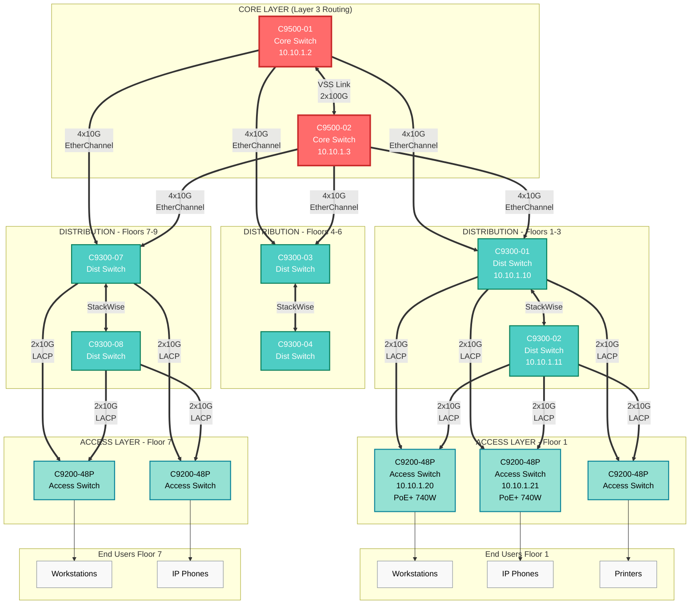

# Campus Network Design — Topología y Arquitectura

> **Propietario:** @network-team @lan-lead  
> **Modelo:** Core-Distribution-Access (Three-Tier)

## 1. Topología Global Campus

### 1.1 Modelo Jerárquico Three-Tier


🎨 Características de los diagramas
Colores diferenciados por capa:

🔴 Core: Rojo (#ff6b6b)
🔵 Distribution: Cyan (#4ecdc4)
🟢 Access: Verde claro (#95e1d3)
🟡 VLANs/SSIDs: Amarillo (#ffd43b)
🟣 Controllers: Púrpura (#845ef7)
⚪ End devices: Gris claro (#f9f9f9)

### 1.2 Roles por Capa

| Layer | Función | Protocolos | Redundancia |
|-------|---------|-----------|-------------|
| **Core** | Backbone de alta velocidad, routing entre VLANs | OSPF, EIGRP, BGP (si multi-site) | VSS (Virtual Switching System) |
| **Distribution** | Aggregation, policy enforcement, L3 gateway | HSRP/VRRP, OSPF | StackWise, dual-homed a core |
| **Access** | Conectividad end-users, PoE, 802.1X | STP, LACP | StackWise, dual-homed a distribution |

---

## 2. Inventario de Switches por Site

### 2.1 HQ — Sede Central
| Hostname | Modelo | Rol | IOS Version | Management IP | Uplink | Notas |
|----------|--------|-----|-------------|--------------|--------|-------|
| CORE-SW-01 | C9500-40X | Core | 17.6.x | 10.10.1.2/24 | 2x100G | VSS Primary |
| CORE-SW-02 | C9500-40X | Core | 17.6.x | 10.10.1.3/24 | 2x100G | VSS Secondary |
| DIST-F1-SW-01 | C9300-48U | Distribution | 17.6.x | 10.10.1.10/24 | 4x10G | Stack Master |
| DIST-F1-SW-02 | C9300-48U | Distribution | 17.6.x | 10.10.1.11/24 | 4x10G | Stack Member |
| ACC-F1-SW-01 | C9200-48P | Access | 17.6.x | 10.10.1.20/24 | 2x10G | PoE+ 740W |
| ACC-F1-SW-02 | C9200-48P | Access | 17.6.x | 10.10.1.21/24 | 2x10G | PoE+ 740W |

### 2.2 Site-A — Oficina Remota
| Hostname | Modelo | Rol | IOS Version | Management IP | Uplink | Notas |
|----------|--------|-----|-------------|--------------|--------|-------|
| DIST-SITEA-SW-01 | C9300-24U | Distribution/Core | 17.6.x | 10.20.1.2/24 | 2x10G WAN | Collapsed core |
| DIST-SITEA-SW-02 | C9300-24U | Distribution/Core | 17.6.x | 10.20.1.3/24 | 2x10G WAN | Collapsed core |
| ACC-SITEA-SW-01 | C9200-24P | Access | 17.6.x | 10.20.1.10/24 | 2x10G | PoE+ |

> **Collapsed Core:** En sites pequeños, distribution y core se combinan en una sola capa

---

## 3. Uplinks y Ancho de Banda

### 3.1 Inter-Layer Links
| Origen | Destino | Tecnología | Bandwidth | Protocol |
|--------|---------|-----------|-----------|----------|
| Access → Distribution | EtherChannel 2x10G | LACP | 20 Gbps | 802.3ad |
| Distribution → Core | EtherChannel 4x10G | LACP | 40 Gbps | 802.3ad |
| Core ↔ Core | VSS Link 2x100G | VSL | 200 Gbps | Cisco VSS |

### 3.2 Port-Channel Configuration (LACP)
```cisco
! En Access Switch
interface range TenGigabitEthernet1/0/47-48
 description Uplink to DIST-F1-SW-01/02
 switchport mode trunk
 switchport trunk allowed vlan 10,20,30,40,50,100
 channel-group 1 mode active
!
interface Port-channel1
 description Uplink to Distribution
 switchport mode trunk
 switchport trunk allowed vlan 10,20,30,40,50,100
```

---

## 4. Spanning Tree Design

### 4.1 Topología STP
- **Protocol:** Rapid PVST+ (Rapid Per-VLAN Spanning Tree)
- **Root Bridge:** Distribution switches (por VLAN)
- **Backup Root:** Alternate distribution switch

```cisco
! Distribution Switch (Root Bridge para VLANs 10,20)
spanning-tree mode rapid-pvst
spanning-tree vlan 10,20 priority 4096
spanning-tree portfast default
spanning-tree portfast bpduguard default

! Access Switch
spanning-tree mode rapid-pvst
spanning-tree vlan 10,20 priority 32768
```

---

## 5. QoS Design

### 5.1 Clases de Tráfico LAN
| Clase | DSCP | CoS | Prioridad | Ejemplos |
|-------|------|-----|-----------|----------|
| Voice | EF (46) | 5 | Highest | VoIP RTP |
| Video | AF41 (34) | 4 | High | Videoconferencia |
| Business Critical | AF31 (26) | 3 | Medium-High | ERP, bases de datos |
| Best Effort | BE (0) | 0 | Normal | Navegación web |

### 5.2 Trust Boundaries
```cisco
! En Access port conectado a Cisco IP Phone
interface GigabitEthernet1/0/1
 description IP Phone + PC
 switchport mode access
 switchport access vlan 20
 switchport voice vlan 30
 mls qos trust cos
 spanning-tree portfast
 spanning-tree bpduguard enable
```

---

## 6. Out-of-Band Management

### 6.1 Management VLAN
- **VLAN ID:** 100 (Management)
- **Subnet:** 10.10.1.0/24
- **Acceso:** Solo desde jump servers en VLAN segura

```cisco
! Management Interface
interface Vlan100
 description Management VLAN
 ip address 10.10.1.20 255.255.255.0
 no shutdown
!
ip default-gateway 10.10.1.1
!
! Acceso SSH restringido
line vty 0 15
 transport input ssh
 access-class 10 in
!
access-list 10 permit 10.10.100.0 0.0.0.255
access-list 10 deny any log
```

---

## Changelog
| Fecha | Autor | Cambio |
|-------|-------|--------|
| YYYY-MM-DD | @lan-lead | Creación inicial |
