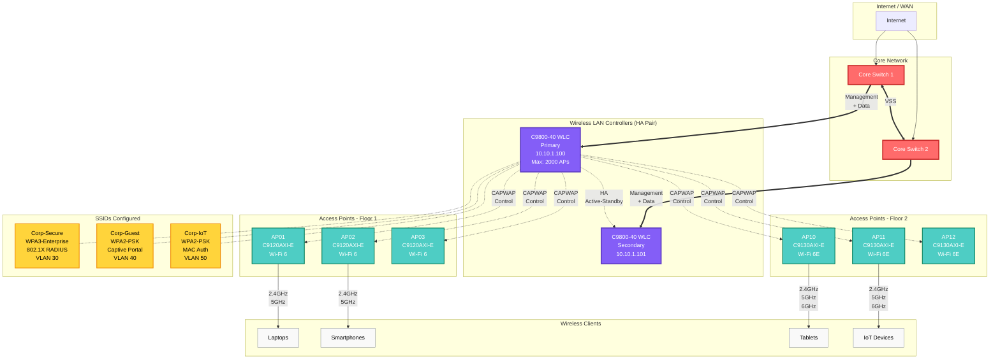

# Wireless Architecture — Wi-Fi 6 Enterprise

> **Propietario:** @network-team @lan-lead  
> **Cisco Catalyst 9800 WLC + Cisco Catalyst 9100 APs**

## 1. Wireless Controller Architecture

### 1.1 Deployment Model: Centralized


🎨 Características de los diagramas
Colores diferenciados por capa:

🔴 Core: Rojo (#ff6b6b)
🔵 Distribution: Cyan (#4ecdc4)
🟢 Access: Verde claro (#95e1d3)
🟡 VLANs/SSIDs: Amarillo (#ffd43b)
🟣 Controllers: Púrpura (#845ef7)
⚪ End devices: Gris claro (#f9f9f9)

### 1.2 Controller Specifications
| Component | Value |
|-----------|-------|
| Model | Cisco Catalyst 9800-40 |
| Max APs | 2000 |
| Max Clients | 32000 |
| Redundancy | HA pair (Active-Standby) |
| Management IP | 10.10.1.100 |

---

## 2. Access Point Deployment

### 2.1 AP Models
| Model | Standard | Max Clients | Radios | PoE | Use Case |
|-------|----------|-------------|--------|-----|----------|
| C9120AXI-E | Wi-Fi 6 (802.11ax) | 200 | 2.4GHz + 5GHz | 802.3at (30W) | Indoor enterprise |
| C9130AXI-E | Wi-Fi 6E | 200 | 2.4GHz + 5GHz + 6GHz | 802.3bt (90W) | High-density |
| C9124AXD-E | Wi-Fi 6 | 100 | 2.4GHz + 5GHz | 802.3at | Outdoor |

### 2.2 AP Placement Guidelines
- **Coverage:** -67 dBm minimum signal strength
- **Capacity:** Max 30-50 clients per AP (high-density: 100+)
- **Channel planning:** Auto (RRM) o manual (no overlap)

---

## 3. SSIDs Configuration

### 3.1 Corporate SSIDs
| SSID | Security | VLAN | Auth | Use |
|------|----------|------|------|-----|
| Corp-Secure | WPA3-Enterprise | 30 | 802.1X (RADIUS) | Employees |
| Corp-Guest | WPA2-PSK | 40 | Captive portal | Guests |
| Corp-IoT | WPA2-PSK | 50 | MAC auth | IoT devices |

### 3.2 WLC SSID Configuration
```cisco
! SSID Corp-Secure
wlan Corp-Secure 1 Corp-Secure
 security wpa akm 802.1x
 security wpa psk set-key ascii MySecurePassword
 no security wpa akm psk
 no shutdown
```

---

## 4. 802.1X Authentication (EAP)

### 4.1 RADIUS Server Integration
```cisco
radius server RADIUS-AD
 address ipv4 10.10.2.10 auth-port 1812 acct-port 1813
 key MyRadiusSecret

aaa group server radius AAA-RADIUS
 server name RADIUS-AD
!
aaa authentication dot1x default group AAA-RADIUS
aaa authorization network default group AAA-RADIUS
```

### 4.2 Certificate-based Auth
- **EAP-TLS:** Certificados cliente + servidor (más seguro)
- **PEAP-MSCHAPv2:** Username/password + certificado servidor

---

## 5. Roaming

### 5.1 Fast Roaming (802.11r)
```cisco
wlan Corp-Secure 1 Corp-Secure
 security ft
 security ft over-the-ds
 security ft reassociation-timeout 20
```

### 5.2 Roaming Triggers
- **Signal strength:** < -75 dBm
- **Roaming time:** Target < 50 ms

---

## 6. Channel Planning

### 6.1 2.4 GHz Channels (Non-Overlapping)
- **Channels:** 1, 6, 11 (North America/Europe)
- **Width:** 20 MHz (no usar 40 MHz en 2.4 GHz - demasiado congestionado)

### 6.2 5 GHz Channels
- **Channels:** 36, 40, 44, 48, 149, 153, 157, 161 (DFS channels también disponibles)
- **Width:** 20/40/80 MHz (80 MHz preferido para Wi-Fi 6)

### 6.3 Auto RF (RRM - Radio Resource Management)
```cisco
! Habilitar RRM
ap dot11 24ghz rrm channel cleanair-event
ap dot11 5ghz rrm channel cleanair-event
```

---

## Changelog
| Fecha | Autor | Cambio |
|-------|-------|--------|
| YYYY-MM-DD | @lan-lead | Creación inicial |
