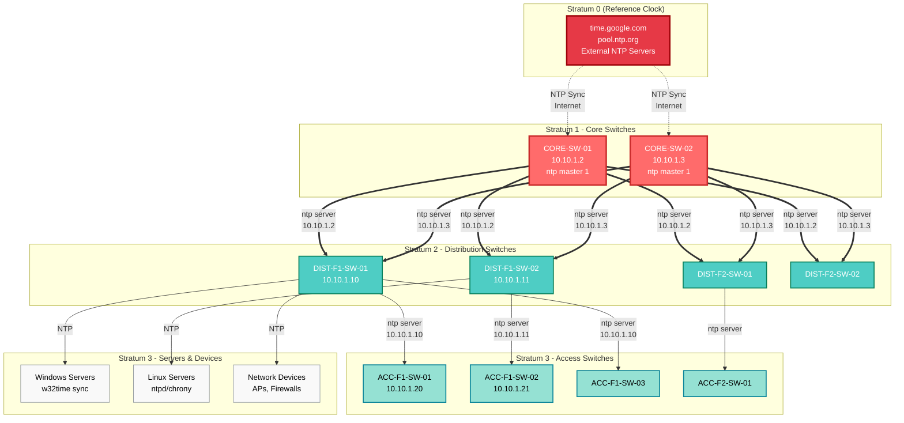

# NTP Configuration — Time Synchronization

> **Propietario:** @network-team @lan-lead

## 1. NTP Hierarchy

### 1.1 Stratum Levels


🎨 Características de los diagramas
Colores diferenciados por capa:

🔴 Core: Rojo (#ff6b6b)

🔵 Distribution: Cyan (#4ecdc4)

🟢 Access: Verde claro (#95e1d3)

🟡 VLANs/SSIDs: Amarillo (#ffd43b)

🟣 Controllers: Púrpura (#845ef7)

⚪ End devices: Gris claro (#f9f9f9)


---

## 2. NTP Configuration on Switches

### 2.1 Core Switches (Stratum 1)
```cisco
! Sincronizar con fuente externa
ntp server time.google.com prefer
ntp server pool.ntp.org

! Permitir que otros switches sincronicen
ntp master 1
```

### 2.2 Distribution/Access (Stratum 2/3)
```cisco
! Sincronizar con core switches
ntp server 10.10.1.2
ntp server 10.10.1.3
```

### 2.3 Verificación
```cisco
show ntp status
show ntp associations
```

---

## Changelog
| Fecha | Autor | Cambio |
|-------|-------|--------|
| YYYY-MM-DD | @lan-lead | Creación inicial |
