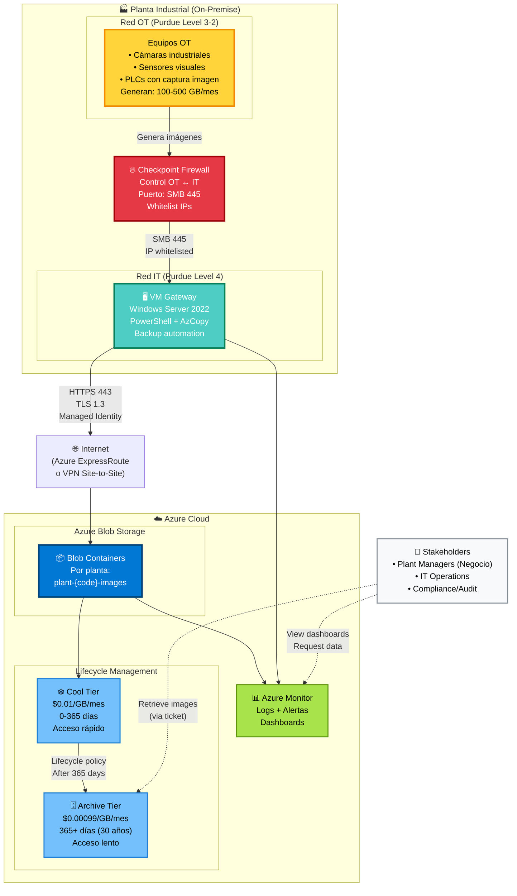

# Industrial Image Backup to Azure — Diseño de Arquitectura

> **Version:** 1.0  
> **Fecha:** 2025-02-19  
> **Estado:** Approved  
> **Autor:** Arquitectura IT  
> **Service Owner:** Arquitectura IT — architecture-team@company.com  
> **Última Revisión:** 2025-02-19

---

## 1. Executive Summary

**Propósito del Servicio:**
Sistema automatizado para backup de imágenes industriales desde redes OT hacia Azure Blob Storage, cumpliendo con el modelo Purdue de seguridad industrial y garantizando retención de largo plazo (30 años) con costes optimizados.

**Scope:**
- ✅ **Sí hace:** Backup automático de imágenes desde equipos OT → Azure, gestión de lifecycle policies, monitorización de transferencias
- ❌ **No hace:** Procesamiento de imágenes, análisis en tiempo real, acceso directo desde OT a Azure (violación Purdue)

**Stakeholders Clave:**
| Rol | Nombre | Equipo | Contacto |
|-----|--------|--------|----------|
| Product Owner | [TBD] | Negocio Industrial | business-industrial@company.com |
| Service Owner | Architecture Lead | Arquitectura IT | architecture-team@company.com |
| Tech Lead | Cloud Architect | Public Cloud Team | cloud-team@company.com |
| SRE Lead | Operations Manager | IT Operations | it-ops@company.com |

---

## 2. Requisitos

### 2.1 Requisitos Funcionales

| ID | Requisito | Prioridad | Estado |
|----|-----------|-----------|--------|
| RF-001 | Copiar imágenes desde red OT a red IT a través de firewall Checkpoint | Must | ✅ Implementado |
| RF-002 | Transferir imágenes desde gateway IT hacia Azure Blob Storage | Must | ✅ Implementado |
| RF-003 | Soportar volumen variable entre 100-500 GB/mes por planta | Must | ✅ Implementado |
| RF-004 | Retención de imágenes durante 30 años | Must | ✅ Implementado |
| RF-005 | Automatización end-to-end sin intervención manual | Must | ✅ Implementado |
| RF-006 | Lifecycle policies automáticas: Cold (1 año) → Archive (29 años) | Must | ✅ Implementado |
| RF-007 | Despliegue en múltiples plantas (Europa y América) | Must | ✅ Implementado |
| RF-008 | Monitoring de transferencias y alertas en caso de fallo | Must | ✅ Implementado |

### 2.2 Requisitos No Funcionales

#### Performance
- **Throughput esperado:** 500 GB/mes/planta = ~17 GB/día = ~12 MB/min (pico: 50 MB/min durante ventana de transferencia)
- **Latencia objetivo:** No crítica (transferencias asíncronas en ventana nocturna)
- **Ventana de transferencia:** 22:00-06:00 horas locales (8 horas disponibles)

#### Escalabilidad
- **Horizontal scaling:** Sí — Cada planta tiene su propia VM gateway independiente
- **Plantas soportadas:** Actualmente 15 plantas, escalable a 50+ sin cambios arquitectónicos
- **Storage scaling:** Azure Blob Storage prácticamente ilimitado (exabytes)

#### Disponibilidad
- **Target availability:** 99.5% mensual (ventana de transferencia)
- **Maintenance windows:** Lunes 02:00-04:00 hora local de cada planta
- **Geographic distribution:** Multi-región (Azure West Europe para plantas EU, Azure East US para plantas América)

#### Seguridad
- **Authentication:** Service Principal con Managed Identity (VM gateway → Azure)
- **Authorization:** RBAC en Azure (Storage Blob Data Contributor role)
- **Data encryption:** 
  - At rest: AES-256 (Azure Storage Service Encryption por defecto)
  - In transit: TLS 1.3 (HTTPS para upload a Azure)
- **Secrets management:** Azure Key Vault para almacenar SAS tokens y credentials
- **Compliance requirements:** Modelo Purdue (ISA-95), ISO 27001, GDPR (datos EU residentes en EU)

#### Compliance y Regulación
| País/Región | Regulación | Requisitos Específicos | Owner |
|-------------|------------|------------------------|-------|
| EU | GDPR | Data residency en Azure West Europe | Arquitectura IT |
| EU | Modelo Purdue (ISA-95) | Segmentación OT/IT, firewall obligatorio | Seguridad IT |
| USA | No specific | Data residency en Azure East US | Arquitectura IT |

---

## 3. Arquitectura

### 3.1 Diagrama C4 - Nivel 1 (Context)

```
┌────────────────────────────────────────────────────────────────┐
│                        Planta Industrial                       │
│                                                                 │
│  ┌──────────────┐    Firewall    ┌──────────────┐            │
│  │   Red OT     │   Checkpoint    │   Red IT     │            │
│  │ (Level 3-2)  │────────────────▶│  (Level 4)   │            │
│  │              │   SMB/443       │              │            │
│  │ • Equipos    │                 │ • Gateway    │            │
│  │   generan    │                 │   VM Windows │            │
│  │   imágenes   │                 │              │            │
│  └──────────────┘                 └──────┬───────┘            │
│                                          │ HTTPS (TLS 1.3)    │
└──────────────────────────────────────────┼────────────────────┘
                                           │
                                           │ Internet
                                           │
                                           ▼
                              ┌─────────────────────────┐
                              │      Azure Cloud        │
                              │                         │
                              │  ┌──────────────────┐  │
                              │  │  Blob Storage    │  │
                              │  │  • Cold (1y)     │  │
                              │  │  • Archive (29y) │  │
                              │  └──────────────────┘  │
                              │                         │
                              │  ┌──────────────────┐  │
                              │  │  Monitor/Alerts  │  │
                              │  └──────────────────┘  │
                              └─────────────────────────┘
```




**Contexto:**
El servicio actúa como puente seguro entre la red OT (Operational Technology) de plantas industriales y Azure Cloud, respetando el modelo Purdue de segmentación. Las imágenes generadas por equipos industriales en OT se copian a la VM gateway en IT, que luego las sube a Azure para almacenamiento de largo plazo.

### 3.2 Diagrama C4 - Nivel 2 (Containers)

```
┌─────────────────────────────────────────────────────────────────────┐
│                     VM Gateway Windows (IT Network)                 │
│                                                                      │
│  ┌────────────────────────────────────────────────────────────────┐│
│  │                    File System (D:\)                            ││
│  │  ┌─────────────┐   ┌─────────────┐   ┌──────────────┐        ││
│  │  │  Incoming/  │   │  Staging/   │   │ Processed/   │        ││
│  │  │  (from OT)  │──▶│  (temp)     │──▶│ (uploaded)   │        ││
│  │  └─────────────┘   └─────────────┘   └──────────────┘        ││
│  └────────────────────────────────────────────────────────────────┘│
│                                                                      │
│  ┌────────────────────────────────────────────────────────────────┐│
│  │              PowerShell Scripts + Task Scheduler                ││
│  │  ┌──────────────┐  ┌──────────────┐  ┌───────────────┐       ││
│  │  │ 1. Monitor   │  │ 2. Upload    │  │ 3. Cleanup    │       ││
│  │  │    Incoming  │─▶│    to Azure  │─▶│    & Archive  │       ││
│  │  │    (every    │  │    (Azcopy)  │  │    (delete    │       ││
│  │  │     5 min)   │  │              │  │     local)    │       ││
│  │  └──────────────┘  └──────────────┘  └───────────────┘       ││
│  └────────────────────────────────────────────────────────────────┘│
│                                                                      │
│  ┌────────────────────────────────────────────────────────────────┐│
│  │                  Azure PowerShell Modules                       ││
│  │  • Az.Storage (upload to Blob)                                 ││
│  │  • Az.Monitor (send metrics)                                   ││
│  │  • Managed Identity (authentication)                           ││
│  └────────────────────────────────────────────────────────────────┘│
└──────────────────────────────────────────────────────────────────────┘
                                │
                                │ HTTPS (443)
                                ▼
                    ┌────────────────────────┐
                    │   Azure Blob Storage   │
                    │                        │
                    │  Container per plant:  │
                    │  plant-{code}-images   │
                    │                        │
                    │  Lifecycle Policy:     │
                    │  0-365d → Cold         │
                    │  365d+ → Archive       │
                    └────────────────────────┘
```

graph TB
    subgraph VM["🖥️ VM Gateway Windows Server 2022<br/>ITGW-FACTORY-{CODE}<br/>192.168.10.50 | 4 vCPU | 16 GB RAM | 1 TB SSD"]
        
        subgraph FS["📁 File System (D:\ImageBackup\)"]
            INC["📥 Incoming/<br/>SMB Share from OT<br/>\\gateway\ImageBackup<br/>Files arrive here"]
            STG["⏳ Staging/<br/>Temporary processing<br/>Awaiting upload"]
            PROC["✅ Processed/<br/>Post-upload<br/>Retained 7 days<br/>Then deleted"]
        end
        
        subgraph SCRIPTS["⚙️ PowerShell Automation<br/>(Task Scheduler)"]
            MON["🔍 Monitor-IncomingImages.ps1<br/>Frequency: Every 5 min<br/>Action: Move Incoming → Staging<br/>Validates: Image extensions"]
            
            UPL["⬆️ Upload-ToAzure.ps1<br/>Frequency: Every 10 min<br/>Tool: AzCopy v10<br/>Features: Batch upload,<br/>MD5 verify, Retry on fail"]
            
            CLN["🧹 Cleanup-LocalFiles.ps1<br/>Frequency: Daily 03:00<br/>Action: Delete Processed/<br/>Retention: > 7 days old"]
        end
        
        subgraph SDK["Azure SDKs & Tools"]
            AZCOPY["AzCopy v10<br/>Multi-threaded<br/>Resume on failure"]
            AZ_PS["Az.Storage Module<br/>PowerShell 7.4"]
            AZ_MON["Az.Monitor Module<br/>Custom metrics"]
        end
        
        subgraph AUTH["🔐 Authentication"]
            MI["Managed Identity<br/>System-assigned<br/>No passwords stored<br/>Auto token refresh"]
        end
        
        subgraph LOGS["📝 Local Logs"]
            LOG_FILES["D:\ImageBackup\Logs\<br/>Monitor-*.log<br/>Upload-*.log<br/>Cleanup-*.log<br/>Retention: 30 days"]
        end
    end
    
    OT_SHARE["OT Network Share<br/>\\ot-server\images"]
    
    subgraph AZURE["☁️ Azure Blob Storage<br/>industrialbackup{region}"]
        CONTAINER["📦 Container<br/>plant-{code}-images<br/>Private access only"]
        
        BLOBS["Blobs (images)<br/>Format: YYYY/MM/DD/<br/>filename.jpg"]
        
        POLICY["Lifecycle Policy<br/>Rule 1: Upload → Cool (0d)<br/>Rule 2: Cool → Archive (365d)"]
    end
    
    subgraph MONITOR["📊 Azure Monitor"]
        LA["Log Analytics<br/>Workspace:<br/>law-industrialbackup-{region}"]
        ALERTS["Alert Rules<br/>• No uploads 24h (P1)<br/>• High error rate (P2)<br/>• Disk full (P2)"]
        DASH["Dashboards<br/>Workbooks:<br/>Upload success rate,<br/>Files per plant"]
    end
    
    OT_SHARE -->|"Copy via FW<br/>SMB 445"| INC
    
    INC --> MON
    MON --> STG
    
    STG --> UPL
    UPL -->|"Uses"| AZCOPY
    UPL -->|"Uses"| AZ_PS
    
    UPL -->|"HTTPS 443<br/>TLS 1.3"| CONTAINER
    
    MI -.->|"OAuth token<br/>RBAC: Storage<br/>Blob Data<br/>Contributor"| CONTAINER
    
    UPL --> PROC
    PROC --> CLN
    
    CONTAINER --> BLOBS
    BLOBS --> POLICY
    
    MON --> LOG_FILES
    UPL --> LOG_FILES
    CLN --> LOG_FILES
    
    LOG_FILES -->|"Shipped via<br/>Azure Monitor<br/>Agent"| LA
    
    UPL -->|"Custom metrics"| AZ_MON
    AZ_MON --> LA
    
    LA --> ALERTS
    LA --> DASH
    
    classDef fsStyle fill:#ffd43b,stroke:#f08c00,stroke-width:2px,color:#000
    classDef scriptStyle fill:#845ef7,stroke:#5f3dc4,stroke-width:2px,color:#fff
    classDef toolStyle fill:#4ecdc4,stroke:#087f5b,stroke-width:2px,color:#fff
    classDef authStyle fill:#e63946,stroke:#9d0208,stroke-width:2px,color:#fff
    classDef azureStyle fill:#0078d4,stroke:#004578,stroke-width:2px,color:#fff
    classDef monitorStyle fill:#a9e34b,stroke:#5c940d,stroke-width:2px,color:#000
    classDef logStyle fill:#f8f9fa,stroke:#868e96,stroke-width:2px,color:#000
    
    class INC,STG,PROC fsStyle
    class MON,UPL,CLN scriptStyle
    class AZCOPY,AZ_PS,AZ_MON toolStyle
    class MI authStyle
    class CONTAINER,BLOBS,POLICY azureStyle
    class LA,ALERTS,DASH monitorStyle
    class LOG_FILES logStyle

```

**Componentes principales:**
1. **File System (D:\):** Directorio estructurado para gestionar flujo de imágenes
   - `D:\ImageBackup\Incoming\` — Destino de copias desde OT (SMB share)
   - `D:\ImageBackup\Staging\` — Temporal durante procesamiento
   - `D:\ImageBackup\Processed\` — Post-upload (antes de delete)
   
2. **PowerShell Automation:** Scripts programados en Task Scheduler
   - `Monitor-IncomingImages.ps1` — Detecta nuevos archivos (cada 5 min)
   - `Upload-ToAzure.ps1` — Usa AzCopy para upload masivo
   - `Cleanup-LocalFiles.ps1` — Elimina locales después de confirmación upload
   
3. **Azure PowerShell Modules:** SDK para interacción con Azure
   - `Az.Storage` — Upload de blobs
   - `Az.Monitor` — Envío de métricas custom
   - Managed Identity — Authentication sin passwords

4. **Azure Blob Storage:** Almacenamiento final con lifecycle management
   - Container por planta: `plant-{factorycode}-images`
   - Hot tier: NO usado (coste alto)
   - Cool tier: Primeros 365 días
   - Archive tier: Después de 365 días (resto de 29 años)

### 3.3 Technology Stack

| Layer | Technology | Version | Justificación |
|-------|------------|---------|---------------|
| Gateway OS | Windows Server 2022 | Standard | Estándar corporativo IT, integración AD, PowerShell nativo |
| Automation | PowerShell | 7.4 + Task Scheduler | Scripting nativo Windows, excelente integración Azure |
| Transfer Tool | AzCopy | v10.x | Optimizado para Azure, resume en fallos, multi-threaded |
| Azure SDK | Az.Storage PowerShell | 6.x | API oficial Azure para Blob operations |
| Authentication | Managed Identity | — | Sin gestión de passwords, rotación automática |
| Storage | Azure Blob Storage | — | Durabilidad 99.999999999%, lifecycle policies nativas |
| Monitoring | Azure Monitor + Log Analytics | — | Integración nativa Azure, alertas automáticas |
| Networking | Azure ExpressRoute / VPN | — | Conectividad privada planta → Azure (no Internet público) |

### 3.4 Data Flow

```
1. Generation Flow (OT → IT):
   [Equipo OT] → genera imagen → guarda en \\ot-share\images
                                              │
                                              ▼
   [Firewall Checkpoint] ← permite SMB (445) ← [Script OT copia a IT]
                                              │
                                              ▼
   [VM Gateway IT] → \\gateway-vm\D$\ImageBackup\Incoming\

2. Upload Flow (IT → Azure):
   [Task Scheduler] ejecuta cada 5 min
                │
                ▼
   [Monitor-IncomingImages.ps1] detecta nuevos archivos
                │
                ▼
   [Upload-ToAzure.ps1] → AzCopy
                │
                ▼
   [HTTPS TLS 1.3] → Azure Blob Storage
                │
                ▼
   [Confirmation] → mueve a Processed/
                │
                ▼
   [Cleanup-LocalFiles.ps1] → delete después 7 días

3. Lifecycle Flow (Azure interno):
   [Upload] → Hot tier (NO, skip directo a Cold)
           │
           ▼
   [0-365 días] → Cool tier ($0.01/GB/mes)
           │
           ▼
   [365+ días] → Archive tier ($0.00099/GB/mes)
           │
           └─ Retención 30 años total
```

**Descripción detallada:**
1. **Generación OT:** Equipos industriales (cámaras, sensores, PLCs) generan imágenes y las almacenan en share local de red OT
2. **Transferencia OT→IT:** Script en servidor OT copia imágenes a través del firewall Checkpoint (puerto SMB 445 permitido con IP whitelisting) hacia share SMB en VM gateway IT
3. **Detección:** Task Scheduler ejecuta script PowerShell cada 5 minutos que escanea carpeta `Incoming/`
4. **Upload:** AzCopy transfiere archivos a Azure Blob con retry automático si falla
5. **Verificación:** Script verifica MD5 hash de upload exitoso
6. **Limpieza:** Archivos locales se mueven a `Processed/` y se eliminan después de 7 días (ventana de troubleshooting)
7. **Lifecycle:** Azure aplica automáticamente policies para mover Cool → Archive después de 1 año

### 3.5 Dependencias

#### Upstream Dependencies (servicios que usamos)

| Servicio | Criticidad | SLO | Contact | Fallback Strategy |
|----------|-----------|-----|---------|-------------------|
| Azure Blob Storage | Critical | 99.99% | azure-support@ | Retry con exponential backoff, queue local si Azure down >1h |
| Active Directory | Critical | 99.95% | windows-team@ | Cached credentials en VM (5 días) |
| Checkpoint Firewall | Critical | 99.9% | network-team@ | Sin fallback - requiere conectividad OT-IT |
| Azure ExpressRoute | High | 99.95% | network-team@ | Fallback a VPN site-to-site si ExpressRoute cae |

#### Downstream Dependencies (servicios que nos usan)

| Servicio | Owner | Comunicación | Impacto si fallamos |
|----------|-------|--------------|---------------------|
| Ninguno | — | — | Las imágenes no se respaldan, pérdida de datos históricos para análisis futuro |

---

## 4. Service Level Objectives (SLOs)

### 4.1 Definición de SLIs

| SLI | Métrica | Fórmula | Fuente de Datos |
|-----|---------|---------|-----------------|
| Upload Success Rate | % de archivos subidos exitosamente | (successful_uploads / total_files_detected) * 100 | PowerShell logs + Azure Monitor |
| Upload Latency | Tiempo desde detección hasta confirmación en Azure | avg(time_uploaded - time_detected) | Custom metrics Azure Monitor |
| Storage Availability | % de tiempo que Azure Blob está accesible | Uptime reportado por Azure | Azure Service Health |
| Data Integrity | % de archivos con MD5 hash correcto | (files_with_valid_hash / total_uploaded) * 100 | AzCopy logs |

### 4.2 SLO Targets

| SLO | Target | Measurement Window | Error Budget |
|-----|--------|-------------------|--------------|
| Upload Success Rate | 99.5% | 30 días | 0.5% = ~15 archivos fallidos de 3000/mes |
| Upload Latency (avg) | < 30 min | 30 días | El 95% de archivos deben subir en < 30 min desde detección |
| Storage Availability | 99.9% | 30 días | Dependiente de Azure SLA (fuera de nuestro control) |
| Data Integrity | 100% | 30 días | 0 archivos corruptos aceptados |

### 4.3 SLA (Customer-Facing)

**Upload SLA:** 99% mensual (medido como % de archivos subidos exitosamente)

**Consecuencias de incumplimiento:**
- < 99%: Revisión interna y reporte a management
- < 95%: Escalado a CTO + plan de mejora obligatorio
- < 90%: Servicio considerado en fallo crítico

**Exclusiones del SLA:**
- Mantenimiento programado de Azure (notificado con 7 días de antelación)
- Fallos en red OT (responsabilidad de IT local de planta)
- Fallos del firewall Checkpoint (responsabilidad de Network team)
- Cortes eléctricos en planta sin UPS

---

## 5. Capacity Planning

### 5.1 Current Capacity

| Recurso | Capacidad Actual | Utilización Actual | Máx. Capacidad |
|---------|------------------|-------------------|----------------|
| VM Gateway (vCPU) | 4 vCPU | 15% (avg) | 8 vCPU (upgrade disponible) |
| VM Gateway (RAM) | 16 GB | 6 GB usado (37%) | 32 GB (upgrade disponible) |
| Local Storage (D:\) | 1 TB SSD | 150 GB usado (15%) | 2 TB (expandible) |
| Azure Blob Storage | Ilimitado | 7.5 TB (15 plantas × 500 GB/mes × 1 año) | Prácticamente ilimitado |
| Network Bandwidth | 1 Gbps (ExpressRoute) | 50 Mbps (peak) | 10 Gbps (upgrade disponible) |

**Rationale for sizing:**
- **500 GB/mes máximo por planta** = ~17 GB/día = ~12 MB/min promedio
- **Ventana de 8 horas** (22:00-06:00) = 480 minutos disponibles
- **Bandwidth requerido:** 17 GB / 480 min = **35 MB/min = 4.7 Mbps** (peak: 10 Mbps)
- **Muy por debajo de 1 Gbps disponible**

### 5.2 Growth Projections

**Historical Growth:**
- Plantas: +3 plantas/año
- Volumen por planta: +10% YoY (mejores cámaras, mayor resolución)

**Projected Needs (12 meses):**
- Plantas: 18 plantas (actualmente 15)
- Volumen total: 9 TB/mes (18 plantas × 500 GB)
- Storage acumulado (Cool): 9 TB (año 1)
- Storage acumulado (Archive): 0 TB (aún no llegamos a 365 días)

**Projected Needs (5 años):**
- Plantas: 30 plantas
- Storage acumulado (Cool): 15 TB (año actual)
- Storage acumulado (Archive): 180 TB (años 1-5 en Archive)

**Scaling Triggers:**
- VM CPU > 60% sustained for 30 min → Upgrade a 8 vCPU
- Local disk > 700 GB → Expand a 2 TB
- Azure bandwidth > 500 Mbps sustained → Upgrade ExpressRoute a 2 Gbps
- Número de plantas > 50 → Evaluar modelo hub-and-spoke con VMs regionales

---

## 6. Disaster Recovery

### 6.1 RPO/RTO

| Tier | RTO (Recovery Time Objective) | RPO (Recovery Point Objective) |
|------|-------------------------------|-------------------------------|
| Tier 2 (Important) | < 8 horas | < 24 horas (máximo 1 día de imágenes perdidas) |

**Clasificación de este servicio:** Tier 2 (Important)

**Justificación:** No es crítico para operaciones en tiempo real (Tier 1), pero pérdida de más de 1 día de imágenes impacta análisis histórico y compliance.

### 6.2 Backup Strategy

| Componente | Frecuencia | Retención | Storage | Tested? |
|------------|-----------|-----------|---------|---------|
| Azure Blob Storage | Redundancia GRS (Geo-Redundant) | 30 años (lifecycle) | Azure (región primaria + secundaria) | ✅ Azure nativo |
| VM Gateway (OS) | Snapshot semanal | 4 semanas | Azure Managed Disks | ✅ Trimestral |
| Scripts PowerShell | On change | Indefinido | Git repository (Azure DevOps) | ✅ CI/CD |
| Configuración VM | Ansible playbook | Indefinido | Git repository | ✅ En cada deploy |

**Nota:** Las imágenes en Azure Blob Storage tienen replicación GRS automática (copia en región secundaria), lo que garantiza durabilidad 99.999999999%.

### 6.3 Disaster Scenarios

| Escenario | Probabilidad | Impacto | Estrategia de Recovery |
|-----------|--------------|---------|------------------------|
| VM Gateway failure | Medium | Medium | Rebuild VM desde Ansible playbook (2-4h) + reanudar uploads desde queue local |
| Azure región primaria down | Very Low | High | Azure failover automático a región secundaria GRS (RTO: < 1h) |
| Pérdida de datos en Azure | Very Low | Critical | Imposible (GRS durability), pero retener copias locales 7 días como safety net |
| Firewall Checkpoint down | Low | High | Coordinar con Network team urgente, backup manual mientras tanto |
| Corrupción de datos (malware) | Low | High | Soft delete habilitado en Azure (recuperar archivos borrados accidentalmente 14 días) |

---

## 7. Security Architecture

### 7.1 Security Controls

| Control | Implementado | Herramienta | Notas |
|---------|--------------|-------------|-------|
| Network Segmentation (Purdue) | ✅ | Checkpoint Firewall | OT Level 3 → IT Level 4 con whitelist IPs |
| Encryption at rest | ✅ | Azure SSE (AES-256) | Automático en Azure Blob Storage |
| Encryption in transit | ✅ | TLS 1.3 (HTTPS) | Todos los uploads a Azure |
| Authentication | ✅ | Managed Identity | VM gateway autenticada en Azure sin passwords |
| Authorization | ✅ | Azure RBAC | Storage Blob Data Contributor role (least privilege) |
| Firewall rules | ✅ | Checkpoint + NSG Azure | Solo puerto 443 outbound desde VM, SMB 445 desde OT (IP whitelist) |
| Audit Logging | ✅ | Azure Storage logs | Todos los accesos a Blob Storage logged |
| Antivirus | ✅ | Windows Defender | Scan de archivos en `Incoming/` antes de upload |
| File Integrity | ✅ | MD5 hash verification | AzCopy verifica integridad en cada upload |

### 7.2 Data Classification

| Tipo de Dato | Clasificación | Cifrado | Acceso | Retención |
|--------------|---------------|---------|--------|-----------|
| Imágenes industriales | Internal | AES-256 at rest + TLS 1.3 in transit | Solo Business + Cloud team | 30 años |
| Logs de transferencia | Internal | TLS 1.3 in transit | IT Ops + Cloud team | 1 año |
| Configuración (secrets) | Confidential | Azure Key Vault | Solo Cloud team (break-glass) | Indefinido |

### 7.3 Network Security

```
┌──────────────────┐
│   Red OT         │
│  (10.x.x.x/16)   │ Level 3-2 (Purdue)
└────────┬─────────┘
         │
         │ Port: SMB 445
         │ Source IPs: 10.x.x.10-20 (whitelisted)
         ▼
  ┌────────────────┐
  │  Checkpoint FW  │ Stateful inspection + ACLs
  └────────┬────────┘
         │
         ▼
┌──────────────────┐
│   Red IT         │
│ (192.168.x.x/24) │ Level 4 (Purdue)
│                  │
│ VM Gateway:      │
│ 192.168.10.50    │
└────────┬─────────┘
         │
         │ Port: HTTPS 443 (outbound only)
         │ Destination: *.blob.core.windows.net
         │ Method: Azure ExpressRoute (private)
         ▼
┌──────────────────────────────┐
│  Azure VNet                  │
│  (10.0.0.0/16)               │
│                              │
│  NSG Rules:                  │
│  • Allow 443 from VM subnet  │
│  • Deny all other inbound    │
│                              │
│  ┌────────────────────────┐ │
│  │  Blob Storage Account  │ │
│  │  • Private Endpoint    │ │
│  │  • No public access    │ │
│  └────────────────────────┘ │
└──────────────────────────────┘
```

**Security Groups/Firewall Rules:**

**Checkpoint Firewall (OT → IT):**
- Allow: TCP 445 (SMB) from 10.x.x.10-20 to 192.168.10.50
- Deny: All other traffic from OT to IT

**VM Gateway (IT → Azure):**
- Allow: TCP 443 (HTTPS) outbound to *.blob.core.windows.net
- Deny: All inbound from Internet
- Allow: RDP 3389 from IT management subnet (192.168.1.0/24)

**Azure NSG:**
- Allow: HTTPS 443 from VM Gateway private IP via ExpressRoute
- Deny: All public Internet access to Storage Account

---

## 8. Cost Estimation

### 8.1 Monthly Cost Breakdown (por planta)

| Componente | Provider | Specs | Costo Mensual (USD) |
|------------|----------|-------|---------------------|
| VM Gateway (IT) | Azure | Standard_D4s_v5 (4 vCPU, 16 GB) | $140 |
| Local Storage (VM) | Azure | 1 TB Premium SSD | $135 |
| Azure Blob Storage (Cool) | Azure | 500 GB (primeros 365 días) | $5 (500 GB × $0.01/GB) |
| Azure Blob Storage (Archive) | Azure | 0 GB (aún no aplica año 1) | $0 |
| Data Transfer OUT | Azure | Mínimo (solo API calls) | $2 |
| ExpressRoute (compartido) | Azure | Prorrateado entre plantas | $50 |
| Azure Monitor | Azure | Métricas custom | $5 |
| **TOTAL por planta (año 1)** | | | **$337/mes** |

### 8.2 Proyección de Costes Long-term

**Año 1 (storage en Cool tier):**
- 15 plantas × $337/mes = **$5,055/mes** = **$60,660/año**
- Storage: 15 plantas × 500 GB × 12 meses = 90 TB acumulado (todo en Cool)

**Año 2 (storage: 50% Cool, 50% Archive):**
- VMs: $4,200/mes (sin cambios)
- Storage Cool: 90 TB × $0.01/GB = $900/mes
- Storage Archive: 90 TB × $0.00099/GB = $89/mes
- **Total año 2:** ~$5,200/mes = **$62,400/año**

**Año 5 (storage: 20% Cool, 80% Archive):**
- VMs: $4,200/mes
- Storage Cool: 90 TB (último año) × $0.01/GB = $900/mes
- Storage Archive: 360 TB (años 1-4) × $0.00099/GB = $356/mes
- **Total año 5:** ~$5,500/mes = **$66,000/año**

**Año 30 (storage: 3.3% Cool, 96.7% Archive):**
- VMs: $4,200/mes (asumiendo inflación 0% - será mayor)
- Storage Cool: 90 TB × $0.01/GB = $900/mes
- Storage Archive: 2,610 TB (29 años) × $0.00099/GB = $2,584/mes
- **Total año 30:** ~$7,700/mes = **$92,400/año**

### 8.3 Cost Optimization Opportunities

- [x] **Azure Reserved Instances para VMs:** Ahorro 30-40% ($140 → $98/mes/VM) — **IMPLEMENTAR**
- [x] **Upload directo a Archive tier (sin Cool):** Azure no permite, requiere pasar por Cool primero — **NO DISPONIBLE**
- [x] **Compresión de imágenes:** Evaluar compresión JPEG → WebP (30% reducción) — **A EVALUAR**
- [x] **Reducir retención local de 7 días a 3 días:** Ahorro mínimo en disk — **OPCIONAL**
- [x] **Azure Spot VMs:** No recomendado (servicio requiere disponibilidad 24/7) — **NO APLICAR**
- [x] **Lifecycle directo a Archive después de 30 días (en lugar de 365):** Ahorro significativo, evaluar requisitos de acceso — **EVALUAR con Business**

**Recomendación:** Implementar Reserved Instances (ahorro ~$630/mes = $7,560/año para 15 plantas).

---

## 9. Decision Log (ADRs)

### ADR-001: Azure Blob Storage en lugar de on-premise NAS

**Fecha:** 2025-01-15  
**Estado:** Accepted  
**Contexto:** Necesitamos almacenar imágenes industriales durante 30 años con alta durabilidad  
**Decisión:** Azure Blob Storage con lifecycle policies (Cool → Archive) en lugar de NAS on-premise  
**Consecuencias:**
- ✅ Durabilidad 99.999999999% (11 nines) — imposible lograr on-premise
- ✅ Sin CAPEX (no comprar hardware NAS)
- ✅ Escalabilidad ilimitada
- ✅ Lifecycle policies automáticas
- ❌ Costes operativos (OPEX) crecen linealmente con datos
- ❌ Requiere conectividad a Azure (ExpressRoute)

### ADR-002: Cool tier 1 año, luego Archive (en lugar de Archive inmediato)

**Fecha:** 2025-01-20  
**Estado:** Accepted  
**Contexto:** Azure no permite upload directo a Archive tier; requiere mínimo en Cool/Hot  
**Decisión:** Mantener imágenes en Cool tier primer año, luego lifecycle a Archive  
**Consecuencias:**
- ✅ Acceso rápido a imágenes recientes (Cool tier: recuperación en minutos)
- ✅ Cumple con restricciones técnicas de Azure
- ❌ Coste ligeramente mayor primer año ($0.01/GB vs $0.00099/GB)
- ❌ Requiere esperar 365 días para máximo ahorro

**Alternativa evaluada:** Upload a Cool y lifecycle inmediato a Archive (30 días) → Rechazado porque imágenes año 1 necesitan acceso ocasional para troubleshooting.

### ADR-003: Windows Server en lugar de Linux para VM Gateway

**Fecha:** 2025-01-22  
**Estado:** Accepted  
**Contexto:** Necesitamos una VM en red IT para actuar como gateway de upload a Azure  
**Decisión:** Windows Server 2022 en lugar de Linux (Ubuntu)  
**Consecuencias:**
- ✅ Estándar corporativo IT (Windows-first organization)
- ✅ Integración nativa con Active Directory
- ✅ PowerShell nativo para scripting Azure
- ✅ SMB share nativo para recibir archivos desde OT
- ❌ Licencia Windows ($50/mes incluido en coste VM)
- ❌ Mayor huella de memoria (16 GB vs 8 GB en Linux)

**Alternativa evaluada:** Linux con Samba → Rechazado por falta de expertise en equipo IT Operations.

### ADR-004: AzCopy en lugar de Azure Storage Explorer o custom script

**Fecha:** 2025-02-01  
**Estado:** Accepted  
**Contexto:** Necesitamos transferir cientos de archivos diarios a Azure Blob Storage  
**Decisión:** Usar AzCopy (CLI tool de Microsoft) en lugar de GUI o script PowerShell custom  
**Consecuencias:**
- ✅ Optimizado para Azure (multi-threaded, resume on failure)
- ✅ MD5 hash verification automática
- ✅ Logging detallado (éxito/fallo por archivo)
- ✅ Mantenido por Microsoft (updates automáticas)
- ❌ Requiere aprendizaje CLI (curva de aprendizaje menor)

**Alternativa evaluada:** Script PowerShell custom con `Set-AzStorageBlobContent` → Rechazado porque AzCopy es 5-10x más rápido en transfers masivos.

---

## 10. Referencias

### 10.1 Enlaces Importantes

- **Repositorio código:** https://dev.azure.com/company/industrial-backup/_git/scripts
- **Azure DevOps Pipeline:** https://dev.azure.com/company/industrial-backup/_build
- **Dashboards:** https://portal.azure.com/#blade/Microsoft_Azure_Monitoring/AzureMonitoringBrowseBlade (filtro: tag=industrial-backup)
- **Runbooks:** [02-deployment-runbook.md](./02-deployment-runbook.md)
- **Azure Storage Account:** `industrialbackup{region}` (ej: `industrialbackupweu` para West Europe)
- **PagerDuty Service:** https://company.pagerduty.com/services/INDBACK01

### 10.2 Related Documentation

- [Instalación y Configuración](./02-deployment-runbook.md)
- [RACI y Ownership](./03-service-ownership.md)
- [Monitorización](./04-observability.md)
- [Service Catalog](./05-service-catalog.md)

### 10.3 External References

- **Azure Blob Storage Lifecycle Management:** https://learn.microsoft.com/en-us/azure/storage/blobs/lifecycle-management-overview
- **AzCopy Documentation:** https://learn.microsoft.com/en-us/azure/storage/common/storage-use-azcopy-v10
- **Purdue Model (ISA-95):** https://www.isa.org/standards-and-publications/isa-standards/isa-standards-committees/isa95
- **Azure Storage Pricing:** https://azure.microsoft.com/en-us/pricing/details/storage/blobs/

---

## 11. Change History

| Version | Fecha | Autor | Cambios |
|---------|-------|-------|---------|
| 1.0 | 2025-02-19 | Arquitectura IT | Versión inicial — 15 plantas piloto Europa/América |

---

## 12. Approval

| Rol | Nombre | Firma | Fecha |
|-----|--------|-------|-------|
| Arquitecto | [Cloud Architect] | ✅ | 2025-02-19 |
| Service Owner | [Architecture Lead] | ✅ | 2025-02-19 |
| Security Lead | [Security Team Lead] | ✅ | 2025-02-19 |
| SRE Lead | [Operations Manager] | ✅ | 2025-02-19 |

---

**Notas:**
- Este documento debe revisarse **cada 6 meses** o cuando se añadan >10 plantas nuevas
- Cambios arquitectónicos significativos (ej: cambio de tier Cool a Hot) requieren nueva versión
- Mantener sincronizado con el código (scripts PowerShell) en Azure DevOps
