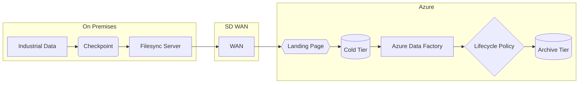

# # Azure Data Protection - Diseño de Arquitectura

> **Version:** 1.2  
> **Fecha:** 24-09-2024  
> **Estado:** [Approved]  
> **Autor:** [Jose Maria Genzor]  
> **Service Owner:** [Roberto Morcillo]  
> **Última Revisión:** 16-10-2024

---

## 1. Executive Summary

**Propósito del Servicio:**
Due to a number of recent market reclamations, a necessity has been identified to clearly define a long-term archive period for Gestamp's OEM data images for quality inspection, such as SmartRay or Vitronic (Usually part measurements, soldering brazing - penetration -. tests of traction...), based on Mapvision or Inline3D software.

The main objective is to determine the minimum time for the data to be transferred and archived and test that both the copy of information into Azure and the recovery are performed successfully.

**Scope:**
This service

**Stakeholders Clave:**

| Rol | Nombre | Equipo | Contacto |
| --- | --- | --- | --- |
| Product Owner |     |     |     |
| Service Owner | Roberto Morcillo | Cloud Architecture |     |
| Tech Lead | Jose M Genzor | Cloud Architecture |     |

## 2. Requisitos

### 2.1 Requisitos Funcionales

| ID  | Requisito | Prioridad | Estado |
| --- | --- | --- | --- |
| RF-001 | The system must support High Availability (HA) configuration. | Must | ✅ Implementado |
| RF-002 | The system must support Disaster Recovery (DR) configuration. | Must | ✅ Implementado |
|     |     | Must/Should/Could |     |

### 2.2 Requisitos No Funcionales

#### Performance

- **Throughput esperado:** The system must support network connectivity of at leat 1 GBps.
- **Latencia objetivo:**
  - p50: [X ms]
  - p95: [X ms]
  - p99: [X ms]
- **Concurrent users:** [X usuarios simultáneos]

#### Escalabilidad

- **Horizontal scaling:** [Sí/No - Detalles]
- **Vertical scaling:** [Sí/No - Detalles]
- **Auto-scaling triggers:** [CPU > 70%, memoria > 80%, custom metrics]

#### Disponibilidad

- **Target availability:** [99.9% = 43.2 min/mes downtime]
- **Maintenance windows:** [Día/hora permitidos para maintenance]
- **Geographic distribution:** [Multi-región, single-región, multi-AZ]

#### Seguridad

- **Authentication:** [OAuth2, SAML, API Keys, mTLS]
- **Authorization:** [RBAC, ABAC, políticas]
- **Data encryption:**
  - At rest: [Método]
  - In transit: [TLS 1.3]
- **Secrets management:** [Vault, AWS Secrets Manager, etc.]
- **Compliance requirements:** [GDPR, SOC2, ISO27001, HIPAA, PCI-DSS, etc.]

#### Compliance y Regulación

| País/Región | Regulación | Requisitos Específicos | Owner |
| --- | --- | --- | --- |
| EU  | GDPR | Data residency, right to deletion |     |
| USA | SOC2 | Audit logs, access controls |     |
| [País] | [Regulación] |     |     |

---

## 3. Arquitectura

### 3.1 Diagrama C4 - Nivel 1 (Context)



### 3.2 Diagrama C4 - Nivel 2 (Containers)

```
┌────────────────────────────────────────────┐
│           [Tu Servicio]                    │
│                                            │
│  ┌─────────┐  ┌─────────┐  ┌──────────┐  │
│  │   API   │  │ Worker  │  │  Cache   │  │
│  │ Gateway │  │ Service │  │  Redis   │  │
│  └────┬────┘  └────┬────┘  └──────────┘  │
│       │            │                       │
│       └────────────┴───────────┐          │
│                                │          │
│                         ┌──────▼──────┐   │
│                         │  PostgreSQL │   │
│                         └─────────────┘   │
└────────────────────────────────────────────┘
```

**Componentes principales:**

1. **API Gateway:** [Kong, Nginx, AWS API Gateway] - [Propósito]
2. **Application Service:** [Node.js, Python, Java] - [Propósito]
3. **Worker/Queue:** [RabbitMQ, SQS, Kafka] - [Propósito]
4. **Cache:** [Redis, Memcached] - [Propósito]
5. **Database:** [PostgreSQL, MongoDB, DynamoDB] - [Propósito]

### 3.3 Technology Stack

| Layer | Technology | Version | Justificación |
| --- | --- | --- | --- |
| Load Balancer |     |     |     |
| Web Server |     |     |     |
| Application |     |     |     |
| Message Queue |     |     |     |
| Cache |     |     |     |
| Database |     |     |     |
| Monitoring |     |     |     |
| Logging |     |     |     |

### 3.4 Data Flow

```
1. Request Flow:
   User → CDN → Load Balancer → API Gateway → Auth Service → Application → Database

2. Async Flow:
   Application → Message Queue → Worker → External API → Database
```

**Descripción detallada:**
[Explicar cómo fluyen los datos a través del sistema]

### 3.5 Dependencias

#### Upstream Dependencies (servicios que usamos)

| Servicio | Criticidad | SLO | Contact | Fallback Strategy |
| --- | --- | --- | --- | --- |
| Auth Service | Critical | 99.95% | auth-team@company.com | Cache de tokens, circuit breaker |
| Payment Gateway | Critical | 99.9% | payments@company.com | Retry con exponential backoff |
| Email Service | Medium | 99.5% | infra@company.com | Queue para reintentos |

#### Downstream Dependencies (servicios que nos usan)

| Servicio | Owner | Comunicación | Impacto si fallamos |
| --- | --- | --- | --- |
| Mobile App | mobile-team@ | REST API | Usuarios no pueden [acción] |
| Analytics | data-team@ | Kafka events | Dashboards desactualizados |

---

## 4. Service Level Objectives (SLOs)

### 4.1 Definición de SLIs

| SLI | Métrica | Fórmula | Fuente de Datos |
| --- | --- | --- | --- |
| Availability | % de requests exitosos | (successful_requests / total_requests) * 100 | Load balancer logs |
| Latency | % requests < threshold | (requests_under_300ms / total_requests) * 100 | APM (Datadog/NewRelic) |
| Error Rate | % de errors 5xx | (5xx_errors / total_requests) * 100 | Application logs |

### 4.2 SLO Targets

| SLO | Target | Measurement Window | Error Budget |
| --- | --- | --- | --- |
| Availability | 99.9% | 30 días | 43.2 min/mes |
| Latency (p95) | < 300ms | 30 días | 5% de requests pueden ser más lentos |
| Error Rate | < 0.1% | 30 días | 10 errors por 10,000 requests |

### 4.3 SLA (Customer-Facing)

**Availability SLA:** 99.5% mensual

**Consecuencias de incumplimiento:**

- < 99.5%: [10% de crédito]
- < 99.0%: [25% de crédito]
- < 98.0%: [50% de crédito]

**Exclusiones del SLA:**

- Maintenance programado (con 72h de aviso)
- Problemas de upstream dependencies fuera de nuestro control
- Ataques DDoS
- Force majeure

---

## 5. Capacity Planning

### 5.1 Current Capacity

| Recurso | Capacidad Actual | Utilización Actual | Máx. Capacidad |
| --- | --- | --- | --- |
| Compute (vCPU) | 64 cores | 45% (avg) | 128 cores |
| Memory | 256 GB | 60% (avg) | 512 GB |
| Storage | 2 TB | 1.2 TB usado | 10 TB |
| Database IOPS | 10,000 | 6,000 (avg) | 20,000 |
| Network Bandwidth | 10 Gbps | 3 Gbps (peak) | 20 Gbps |

### 5.2 Growth Projections

**Historical Growth:**

- Usuarios: [+20% YoY]
- Requests: [+35% YoY]
- Data: [+50% YoY]

**Projected Needs (12 meses):**

- Compute: [80 cores]
- Memory: [320 GB]
- Storage: [3 TB]

**Scaling Triggers:**

- CPU > 70% sustained for 10 min → Add instances
- Memory > 80% → Vertical scaling review
- Storage > 70% → Expand volumes

---

## 6. Disaster Recovery

### 6.1 RPO/RTO

| Tier | RTO (Recovery Time Objective) | RPO (Recovery Point Objective) |
| --- | --- | --- |
| Tier 1 (Critical) | < 1 hora | < 5 minutos |
| Tier 2 (Important) | < 4 horas | < 30 minutos |
| Tier 3 (Normal) | < 24 horas | < 24 horas |

**Clasificación de este servicio:** [Tier X]

### 6.2 Backup Strategy

| Componente | Frecuencia | Retención | Storage | Tested? |
| --- | --- | --- | --- | --- |
| Database | Continuous (PITR) | 30 días | S3 Cross-Region | ✅ Mensual |
| Configuration | On change | Indefinido | Git | ✅ En cada deploy |
| Application State | Diario | 7 días | S3  | ✅ Trimestral |

### 6.3 Disaster Scenarios

| Escenario | Probabilidad | Impacto | Estrategia de Recovery |
| --- | --- | --- | --- |
| AZ failure | Low | High | Automatic failover a otra AZ (< 5 min) |
| Region failure | Very Low | Critical | Manual failover a DR region (< 1h) |
| Data corruption | Medium | High | Point-in-time recovery desde backup |
| Security breach | Low | Critical | Incident response plan → Restore desde clean backup |

---

## 7. Security Architecture

### 7.1 Security Controls

| Control | Implementado | Herramienta | Notas |
| --- | --- | --- | --- |
| WAF | ✅   | CloudFlare/AWS WAF | Rules para OWASP Top 10 |
| DDoS Protection | ✅   | CloudFlare |     |
| IDS/IPS | ✅   | Snort/Suricata |     |
| Vulnerability Scanning | ✅   | Qualys/Nessus | Semanal |
| Secrets Rotation | ✅   | Vault | 90 días |
| MFA | ✅   | Okta | Para acceso admin |
| Audit Logging | ✅   | Splunk | Retención 1 año |

### 7.2 Data Classification

| Tipo de Dato | Clasificación | Cifrado | Acceso | Retención |
| --- | --- | --- | --- | --- |
| PII (nombre, email) | Confidential | AES-256 | Need-to-know | Según GDPR |
| Financial data | Restricted | AES-256 + tokenization | Finance team only | 7 años |
| Logs | Internal | TLS in-transit | Ops teams | 1 año |

### 7.3 Network Security

```
Internet
   ↓
[CDN/DDoS Protection]
   ↓
[WAF]
   ↓
[Public Subnet - Load Balancer]
   ↓
[Private Subnet - Application]
   ↓
[Isolated Subnet - Database]
```

**Security Groups/Firewall Rules:**

- Load Balancer: Allow 443 from 0.0.0.0/0
- Application: Allow 8080 from Load Balancer only
- Database: Allow 5432 from Application only

---

## 8. Cost Estimation

### 8.1 Monthly Cost Breakdown

| Componente | Provider | Specs | Costo Mensual (USD) |
| --- | --- | --- | --- |
| Compute (EC2/VMs) | AWS | 4x m5.xlarge | $480 |
| Database (RDS) | AWS | db.r5.large Multi-AZ | $620 |
| Storage (S3/EBS) | AWS | 2TB | $150 |
| Load Balancer | AWS | ALB | $30 |
| Data Transfer | AWS | 5TB out | $450 |
| Monitoring | Datadog | 10 hosts | $150 |
| Logging | Splunk | 50GB/day | $300 |
| **TOTAL** |     |     | **$2,180** |

### 8.2 Cost Optimization Opportunities

- [ ] Reserved Instances (save 30-40%)
- [ ] Spot instances for non-critical workloads
- [ ] S3 lifecycle policies para logs antiguos
- [ ] Right-sizing de instancias basado en métricas

---

## 9. Decision Log (ADRs)

### ADR-001: Elección de Base de Datos

**Fecha:** 2024-03-15  
**Estado:** Accepted  
**Contexto:** Necesitamos una base de datos para [use case]  
**Decisión:** PostgreSQL en lugar de MongoDB  
**Consecuencias:**

- ✅ Transacciones ACID
- ✅ Madurez y soporte
- ❌ Menos flexible para schema changes

### ADR-002: [Título]

[Repetir estructura]

---

## 10. Referencias

### 10.1 Enlaces Importantes

- **Repositorio código:** https://github.com/company/service-name
- **CI/CD Pipeline:** https://jenkins.company.com/job/service-name
- **Dashboards:** https://grafana.company.com/d/service-name
- **Runbooks:** https://wiki.company.com/runbooks/service-name
- **API Docs:** https://api.company.com/docs/service-name
- **PagerDuty Service:** https://company.pagerduty.com/services/ABC123

### 10.2 Related Documentation

- [Instalación y Configuración](./02-deployment-runbook.md)
- [RACI y Ownership](./03-service-ownership.md)
- [Monitorización](./04-observability.md)
- [Incident Runbooks](./06-incident-management.md)

---

## 11. Change History

| Version | Fecha | Autor | Cambios |
| --- | --- | --- | --- |
| 1.0 | 2024-03-15 | Juan Pérez | Versión inicial |
| 1.1 | 2024-04-01 | María García | Añadido ADR-002 |

---

## 12. Approval

| Rol | Nombre | Firma | Fecha |
| --- | --- | --- | --- |
| Arquitecto |     |     |     |
| Service Owner |     |     |     |
| Security Lead |     |     |     |
| SRE Lead |     |     |     |

---

**Notas:**

- Este documento debe revisarse al menos cada 6 meses
- Cambios arquitectónicos significativos requieren nueva versión
- Mantener sincronizado con el código (IaC) en todo momento
