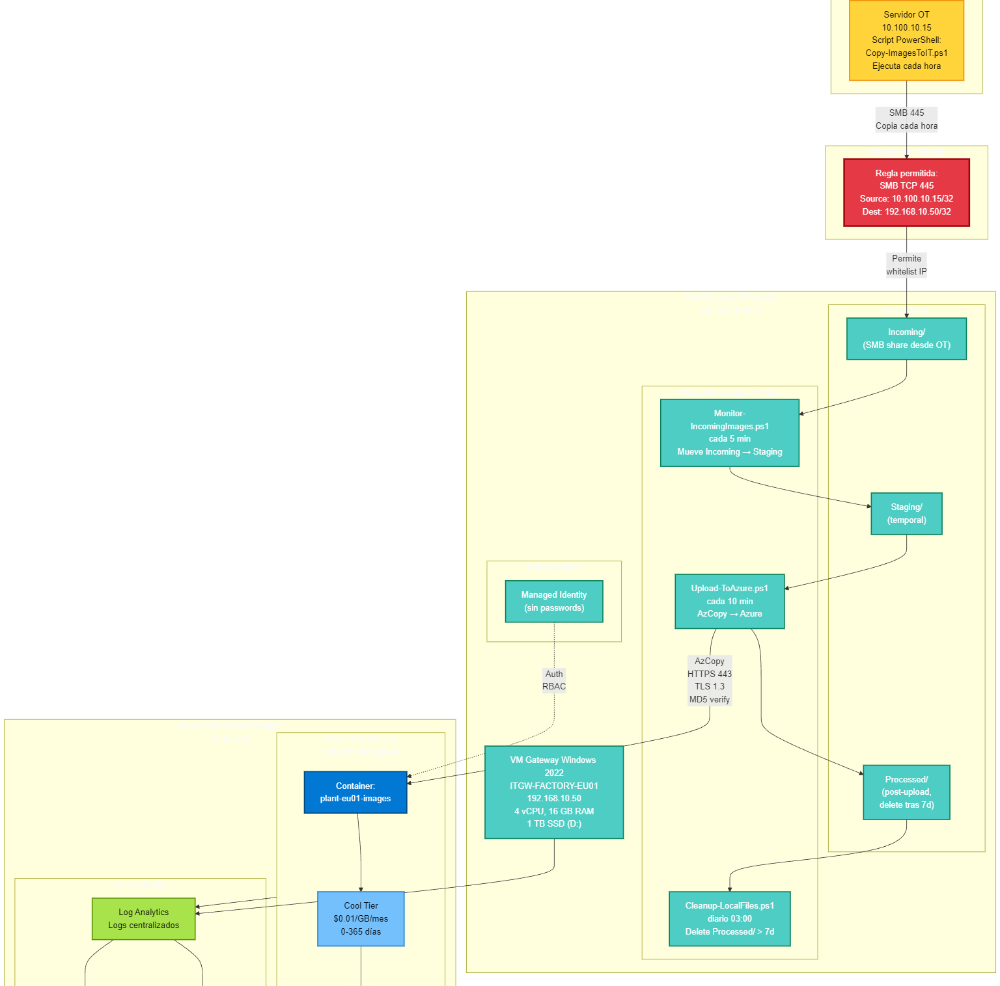

# Azure Data Protection

## 📋 Quick Info
- **Owner Team:** Cloud Architecture
- **On-Call:** [Rotation link]
- **Teams Channel:** @Cloud Architecture

## 🎯 Purpose
The main objective is to determine the minimum time for the data to be transferred and archived and test that both the copy of information into Azure and the recovery are performed successfully.

## 🏗️ Architecture

## 📊 SLOs
| Metric | Target | Error Budget |
|--------|--------|--------------|
| Availability | 99.9% | 43 min/month |
| Latency (p95) | < 200ms | - |

## 🔗 Key Links
- [Architecture Docs](docs/architecture/)
- [Runbooks](docs/operations/runbooks/)
- [Monitoring Dashboard](https://portal.azure.com/...)
- [Incident Log](https://dev.azure.com/.../incident-log)

## 🚀 Getting Started
- [Local Development](docs/development/local-setup.md)
- [Deployment Guide](docs/operations/runbooks/deployment.md)

## 📞 Contact
- **Emergency:** Page via [PagerDuty/Opsgenie]
- **Questions:** @Cloud Architecture on Teams
