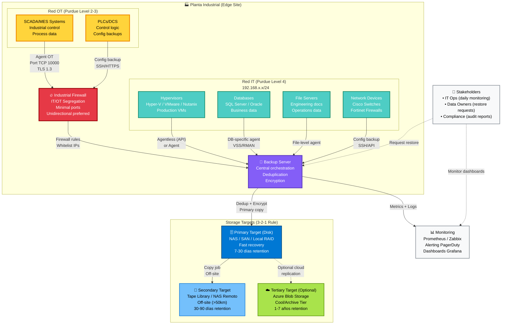

```mermaid
graph TB
    subgraph PLANT["🏭 Planta Industrial (Edge Site)"]
        subgraph OT_ZONE["Red OT (Purdue Level 2-3)<br/>10.x.x.x/16"]
            SCADA["SCADA/MES Systems<br/>Industrial control<br/>Process data"]
            PLC["PLCs/DCS<br/>Control logic<br/>Config backups"]
        end
        
        FW["🔥 Industrial Firewall<br/>IT/OT Segregation<br/>Minimal ports<br/>Unidirectional preferred"]
        
        subgraph IT_ZONE["Red IT (Purdue Level 4)<br/>192.168.x.x/24"]
            HV["Hypervisors<br/>Hyper-V / VMware / Nutanix<br/>Production VMs"]
            DB["Databases<br/>SQL Server / Oracle<br/>Business data"]
            FS["File Servers<br/>Engineering docs<br/>Operations data"]
            NET["Network Devices<br/>Cisco Switches<br/>Fortinet Firewalls"]
        end
        
        BACKUP_SRV["💾 Backup Server<br/>Central orchestration<br/>Deduplication<br/>Encryption"]
    end
    
    subgraph TARGETS["Storage Targets (3-2-1 Rule)"]
        PRIMARY["🗄️ Primary Target (Disk)<br/>NAS / SAN / Local RAID<br/>Fast recovery<br/>7-30 días retention"]
        
        SECONDARY["📼 Secondary Target<br/>Tape Library / NAS Remoto<br/>Off-site (>50km)<br/>30-90 días retention"]
        
        TERTIARY["☁️ Tertiary Target (Optional)<br/>Azure Blob Storage<br/>Cool/Archive Tier<br/>1-7 años retention"]
    end
    
    USERS["👥 Stakeholders<br/>• IT Ops (daily monitoring)<br/>• Data Owners (restore requests)<br/>• Compliance (audit reports)"]
    
    MON["📊 Monitoring<br/>Prometheus / Zabbix<br/>Alerting PagerDuty<br/>Dashboards Grafana"]
    
    %% Data flows
    SCADA -->|"Agent OT<br/>Port TCP 10000<br/>TLS 1.3"| FW
    PLC -->|"Config backup<br/>SSH/HTTPS"| FW
    
    FW -->|"Firewall rules<br/>Whitelist IPs"| BACKUP_SRV
    
    HV -->|"Agentless (API)<br/>or Agent"| BACKUP_SRV
    DB -->|"DB-specific agent<br/>VSS/RMAN"| BACKUP_SRV
    FS -->|"File-level agent"| BACKUP_SRV
    NET -->|"Config backup<br/>SSH/API"| BACKUP_SRV
    
    BACKUP_SRV -->|"Dedup + Encrypt<br/>Primary copy"| PRIMARY
    PRIMARY -->|"Copy job<br/>Off-site"| SECONDARY
    PRIMARY -.->|"Optional cloud<br/>replication"| TERTIARY
    
    BACKUP_SRV -->|"Metrics + Logs"| MON
    
    USERS -.->|"Monitor dashboards"| MON
    USERS -.->|"Request restore"| BACKUP_SRV
    
    classDef otStyle fill:#ffd43b,stroke:#f08c00,stroke-width:3px,color:#000
    classDef fwStyle fill:#e63946,stroke:#9d0208,stroke-width:3px,color:#fff
    classDef itStyle fill:#4ecdc4,stroke:#087f5b,stroke-width:2px,color:#fff
    classDef backupStyle fill:#845ef7,stroke:#5f3dc4,stroke-width:3px,color:#fff
    classDef primaryStyle fill:#0078d4,stroke:#004578,stroke-width:2px,color:#fff
    classDef secondaryStyle fill:#74c0fc,stroke:#1c7ed6,stroke-width:2px,color:#000
    classDef cloudStyle fill:#a9e34b,stroke:#5c940d,stroke-width:2px,color:#000
    classDef userStyle fill:#f8f9fa,stroke:#868e96,stroke-width:2px,color:#000
    
    class SCADA,PLC otStyle
    class FW fwStyle
    class HV,DB,FS,NET itStyle
    class BACKUP_SRV backupStyle
    class PRIMARY primaryStyle
    class SECONDARY secondaryStyle
    class TERTIARY cloudStyle
    class USERS,MON userStyle
```
