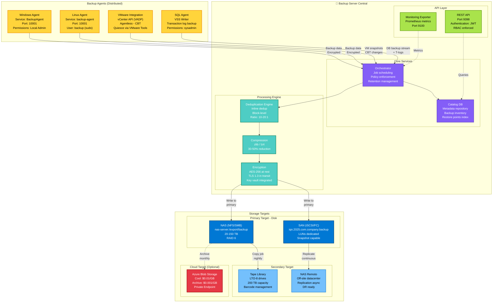

```mermaid
graph TB
    subgraph AGENTS["Backup Agents (Distributed)"]
        AG_WIN["Windows Agent<br/>Service: BackupAgent<br/>Port: 10001<br/>Permissions: Local Admin"]
        AG_LIN["Linux Agent<br/>Service: backup-agent<br/>Port: 10001<br/>User: backup (sudo)"]
        AG_VMWARE["VMware Integration<br/>vCenter API (VADP)<br/>Agentless - CBT<br/>Quiesce via VMware Tools"]
        AG_SQL["SQL Agent<br/>VSS Writer<br/>Transaction log backup<br/>Permissions: sysadmin"]
    end
    
    subgraph BACKUP_SERVER["💾 Backup Server Central"]
        subgraph CORE["Core Services"]
            ORCH["Orchestrator<br/>Job scheduling<br/>Policy enforcement<br/>Retention management"]
            CAT["Catalog DB<br/>Metadata repository<br/>Backup inventory<br/>Restore points index"]
        end
        
        subgraph PROC["Processing Engine"]
            DEDUP["Deduplication Engine<br/>Inline dedup<br/>Block-level<br/>Ratio: 10-20:1"]
            COMP["Compression<br/>zlib / lz4<br/>30-50% reduction"]
            ENC["Encryption<br/>AES-256 at rest<br/>TLS 1.3 in transit<br/>Key vault integrated"]
        end
        
        subgraph API["API Layer"]
            REST_API["REST API<br/>Port 9398<br/>Authentication: JWT<br/>RBAC enforced"]
            MON_API["Monitoring Exporter<br/>Prometheus metrics<br/>Port 9100"]
        end
    end
    
    subgraph STORAGE["Storage Targets"]
        subgraph PRIMARY_TARGET["Primary Target - Disk"]
            NAS["NAS (NFS/SMB)<br/>nas-server:/export/backup<br/>20-150 TB<br/>RAID 6"]
            SAN["SAN (iSCSI/FC)<br/>iqn.2025.com.company:backup<br/>LUNs dedicated<br/>Snapshot capable"]
        end
        
        subgraph SECONDARY_TARGET["Secondary Target"]
            TAPE["Tape Library<br/>LTO-8 drives<br/>200 TB capacity<br/>Barcode management"]
            NAS_REMOTE["NAS Remoto<br/>Off-site datacenter<br/>Replication async<br/>DR ready"]
        end
        
        subgraph CLOUD_TARGET["Cloud Target (Optional)"]
            AZURE["Azure Blob Storage<br/>Cool: $0.01/GB<br/>Archive: $0.001/GB<br/>Private Endpoint"]
        end
    end
    
    %% Data flows
    AG_WIN -->|"Backup data<br/>Encrypted"| ORCH
    AG_LIN -->|"Backup data<br/>Encrypted"| ORCH
    AG_VMWARE -->|"VM snapshots<br/>CBT changes"| ORCH
    AG_SQL -->|"DB backup stream<br/>+ T-logs"| ORCH
    
    ORCH --> CAT
    ORCH --> DEDUP
    DEDUP --> COMP
    COMP --> ENC
    
    ENC -->|"Write to<br/>primary"| NAS
    ENC -->|"Write to<br/>primary"| SAN
    
    NAS -->|"Copy job<br/>nightly"| TAPE
    SAN -->|"Replicate<br/>continuous"| NAS_REMOTE
    
    NAS -.->|"Archive<br/>monthly"| AZURE
    
    REST_API -.->|"Queries"| CAT
    MON_API -.->|"Metrics"| ORCH
    
    classDef agentStyle fill:#ffd43b,stroke:#f08c00,stroke-width:2px,color:#000
    classDef coreStyle fill:#845ef7,stroke:#5f3dc4,stroke-width:2px,color:#fff
    classDef procStyle fill:#4ecdc4,stroke:#087f5b,stroke-width:2px,color:#fff
    classDef apiStyle fill:#a9e34b,stroke:#5c940d,stroke-width:2px,color:#000
    classDef primaryStyle fill:#0078d4,stroke:#004578,stroke-width:2px,color:#fff
    classDef secondaryStyle fill:#74c0fc,stroke:#1c7ed6,stroke-width:2px,color:#000
    classDef cloudStyle fill:#e63946,stroke:#9d0208,stroke-width:2px,color:#fff
    
    class AG_WIN,AG_LIN,AG_VMWARE,AG_SQL agentStyle
    class ORCH,CAT coreStyle
    class DEDUP,COMP,ENC procStyle
    class REST_API,MON_API apiStyle
    class NAS,SAN primaryStyle
    class TAPE,NAS_REMOTE secondaryStyle
    class AZURE cloudStyle
```
