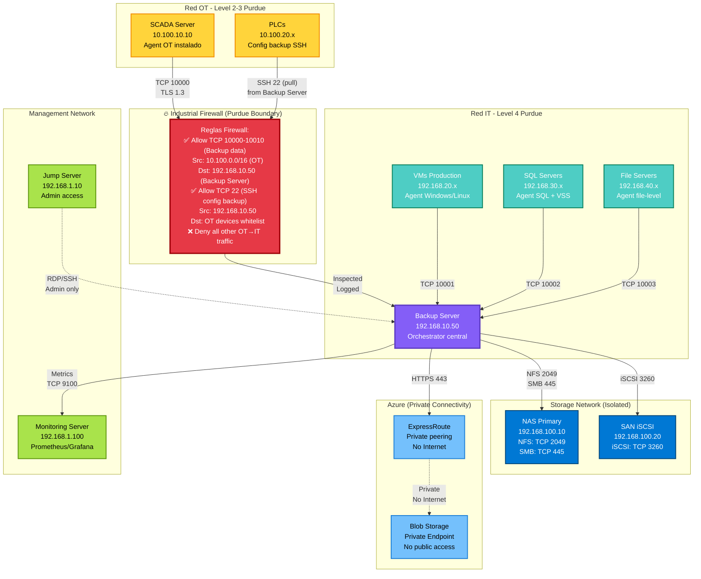

```mermaid
graph TB
    subgraph OT["Red OT - Level 2-3 Purdue"]
        OT_SCADA["SCADA Server<br/>10.100.10.10<br/>Agent OT instalado"]
        OT_PLC["PLCs<br/>10.100.20.x<br/>Config backup SSH"]
    end
    
    subgraph FIREWALL["🔥 Industrial Firewall (Purdue Boundary)"]
        FW_RULES["Reglas Firewall:<br/>✅ Allow TCP 10000-10010 (Backup data)<br/>   Src: 10.100.0.0/16 (OT)<br/>   Dst: 192.168.10.50 (Backup Server)<br/>✅ Allow TCP 22 (SSH config backup)<br/>   Src: 192.168.10.50<br/>   Dst: OT devices whitelist<br/>❌ Deny all other OT→IT traffic"]
    end
    
    subgraph IT["Red IT - Level 4 Purdue"]
        IT_VM["VMs Production<br/>192.168.20.x<br/>Agent Windows/Linux"]
        IT_DB["SQL Servers<br/>192.168.30.x<br/>Agent SQL + VSS"]
        IT_FS["File Servers<br/>192.168.40.x<br/>Agent file-level"]
        
        BACKUP_SRV["Backup Server<br/>192.168.10.50<br/>Orchestrator central"]
    end
    
    subgraph STORAGE_NET["Storage Network (Isolated)"]
        NAS["NAS Primary<br/>192.168.100.10<br/>NFS: TCP 2049<br/>SMB: TCP 445"]
        SAN["SAN iSCSI<br/>192.168.100.20<br/>iSCSI: TCP 3260"]
    end
    
    subgraph AZURE_NET["Azure (Private Connectivity)"]
        EXPRESSROUTE["ExpressRoute<br/>Private peering<br/>No Internet"]
        BLOB["Blob Storage<br/>Private Endpoint<br/>No public access"]
    end
    
    subgraph MGMT["Management Network"]
        MONITOR["Monitoring Server<br/>192.168.1.100<br/>Prometheus/Grafana"]
        JUMP["Jump Server<br/>192.168.1.10<br/>Admin access"]
    end
    
    %% OT to Backup Server (via FW)
    OT_SCADA -->|"TCP 10000<br/>TLS 1.3"| FW_RULES
    OT_PLC -->|"SSH 22 (pull)<br/>from Backup Server"| FW_RULES
    FW_RULES -->|"Inspected<br/>Logged"| BACKUP_SRV
    
    %% IT to Backup Server (direct)
    IT_VM -->|"TCP 10001"| BACKUP_SRV
    IT_DB -->|"TCP 10002"| BACKUP_SRV
    IT_FS -->|"TCP 10003"| BACKUP_SRV
    
    %% Backup Server to Storage
    BACKUP_SRV -->|"NFS 2049<br/>SMB 445"| NAS
    BACKUP_SRV -->|"iSCSI 3260"| SAN
    
    %% Backup Server to Azure (via ER)
    BACKUP_SRV -->|"HTTPS 443"| EXPRESSROUTE
    EXPRESSROUTE -.->|"Private<br/>No Internet"| BLOB
    
    %% Monitoring
    BACKUP_SRV -->|"Metrics<br/>TCP 9100"| MONITOR
    
    %% Admin access
    JUMP -.->|"RDP/SSH<br/>Admin only"| BACKUP_SRV
    
    classDef otStyle fill:#ffd43b,stroke:#f08c00,stroke-width:2px,color:#000
    classDef fwStyle fill:#e63946,stroke:#9d0208,stroke-width:3px,color:#fff
    classDef itStyle fill:#4ecdc4,stroke:#087f5b,stroke-width:2px,color:#fff
    classDef backupStyle fill:#845ef7,stroke:#5f3dc4,stroke-width:3px,color:#fff
    classDef storageStyle fill:#0078d4,stroke:#004578,stroke-width:2px,color:#fff
    classDef azureStyle fill:#74c0fc,stroke:#1c7ed6,stroke-width:2px,color:#000
    classDef mgmtStyle fill:#a9e34b,stroke:#5c940d,stroke-width:2px,color:#000
    
    class OT_SCADA,OT_PLC otStyle
    class FW_RULES fwStyle
    class IT_VM,IT_DB,IT_FS itStyle
    class BACKUP_SRV backupStyle
    class NAS,SAN storageStyle
    class EXPRESSROUTE,BLOB azureStyle
    class MONITOR,JUMP mgmtStyle
```
